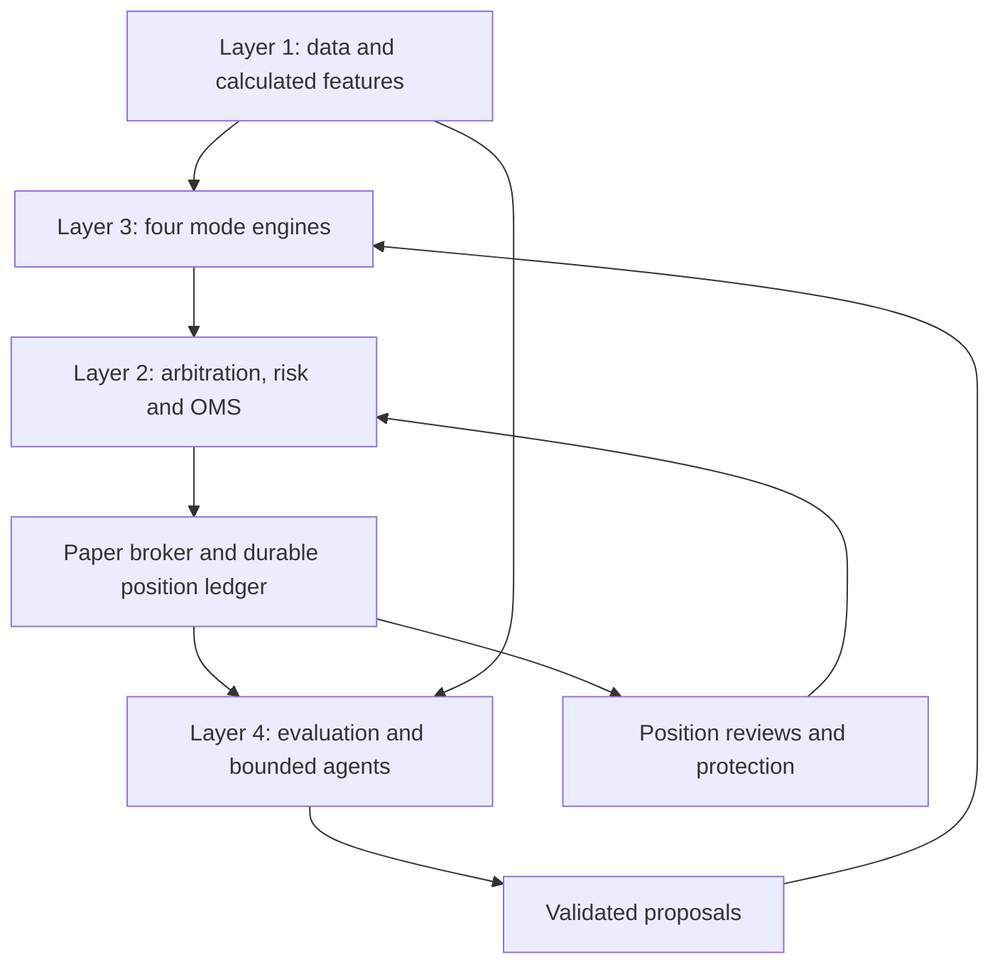

# NIFTY Four-Mode Trading System — Cursor Redesign Specification

**Version:** 1.1  
**Prepared:** 23 September 2026  
**Checkout verification:** 24 September 2026, branch `main`, commit `47dcf15` (dirty working tree preserved; see §31)  
**Purpose:** Complete implementation brief for redesigning the existing four-layer trading system, its paper runtime, agent workflows, risk controls, tests, operations and documentation.  
**Delivery format:** A self-contained Markdown specification intended to be placed in the repository and read by Cursor.  
**Scope:** NIFTY options only; live-market PAPER execution and separately labelled experimental observations. Real-money activation is outside this change.  
**Status:** Target requirements. Satisfaction is recorded only in [REQUIREMENT_TRACEABILITY.md](REQUIREMENT_TRACEABILITY.md) and [FOUR_MODE_COMPONENT_CHANGES.md](FOUR_MODE_COMPONENT_CHANGES.md). This file is not evidence that the checkout already behaves this way.

### 0.0 Early gates (binding)

Three gates block later build work. They are specified in §31 and in [FOUR_MODE_REDESIGN_PLAN.md](FOUR_MODE_REDESIGN_PLAN.md).

1. **G1 — one-lot feasibility.** The §10.1 percentages set risk order only. A mode × family stays non-executable until one complete structure fits the current NIFTY lot, quoted premiums, charges, and that mode’s per-trade cap. Do not raise the cap or split a lot to force a pass.
2. **G2 — implemented is not unattended PAPER.** A class or payoff test is `IMPLEMENTED_UNIT`. `PAPER` stance requires entry, partial-fill recovery, monitoring, exit, and restart evidence for that family.
3. **G3 — CAS data and timing.** Mode 1 is a microstructure mandate. NSE’s Closing Auction Session is a cash-market mechanism. Verify actual NIFTY option or proxy fields and entry latency before any M1 selector or stance change. A 60-second entry loop is not microstructure execution.

---

## 0. Instructions to Cursor — start here

Treat this document as the new product requirements baseline. Implement the redesign in the existing repository. Read the complete document once during planning; do not repeatedly reload it during implementation. Follow the context workflow in Section 28.

The user has authorized the redesign, including all four modes, the expanded strategy basket, tests, configuration migration and documentation updates. Do not stop merely to ask whether to implement the next routine phase. Make reversible implementation choices, record assumptions, and continue. Ask only when a genuinely missing external input prevents a dependent action. Complete independent work while that input is unavailable.

This document specifies desired behavior. It does **not** certify what the current repository implements. Earlier conversational audits referred to different branches and dates. Inspect the current checkout and runtime before relying on any old statement. Do not mark a strategy integrated because a class or unit test exists.

### 0.1 First actions

1. Identify repository root, branch, HEAD, working-tree changes, relevant project instructions and existing test commands.
2. Preserve user changes and open-position state. Do not reset the working tree, rewrite history, delete runtime data, or overwrite active configuration indiscriminately.
3. Read existing architecture, current-state, task-ledger, strategy contracts, risk configuration, paper session, position lifecycle and agent permission documentation.
4. Trace one current order from market data to final fill, one exit, one restart recovery and one review action.
5. Produce a requirement-to-code gap matrix. Every row needs a requirement ID, existing implementation location, current status, gap, planned change and acceptance evidence.
6. Create a phased implementation ledger with compact per-phase briefs. Then implement sequentially, updating code and documentation together.
7. Keep live execution blocked. Build usable paper behavior; do not substitute a presentation, scaffolding, empty strategy stubs or advisory-only output for runtime integration.

### 0.2 Interpretation rules

- MUST: acceptance requirement.
- SHOULD: strong design preference; deviations require a recorded reason.
- PROPOSED PAPER DEFAULT: an engineering starting value, not a validated trading parameter or a user-approved real-money limit.
- EXTERNAL VERIFICATION REQUIRED: verify against current exchange/broker/data-provider information, retaining source and effective date.
- BLOCKED: actual dependency missing. Identify exactly what is blocked; do not block unrelated modes.
- All monetary figures are INR unless explicitly labelled otherwise.
- All percentage risk comparisons are relative to the respective mode's allocated capital, not absolute rupees or margin alone.

### 0.3 Completion standard

Deliver a working paper runtime for the four modes, with the entire requested basket implemented and exercised where its input and lifecycle requirements can be satisfied. Experimental structures that cannot meet strict bounded-risk requirements must remain visible with exact blockers; never falsely label them executable. Provide commands, scenario artifacts, changed-document list and an honest residual-limitations report.

---

## 1. Product intent and non-negotiable boundaries

### R-001 — Instrument scope

Execute only NIFTY index options. Exclude stock options, BANKNIFTY, MCX, equities, ETFs and futures execution from this deployment. Futures or constituent data may be consumed as NIFTY signals; consuming data does not authorize trading those instruments. Preserve reusable commodity code where sensible, but disable its runtime paths and remove it from active-scope documentation.

### R-002 — Four independent mandates

Implement four named modes with distinct entry and management policies:

1. `M1_CAS`: aggressive, frequent, small-capital speculative option buying.
2. `M2_DIRECTIONAL`: highest directional conviction, single-leg option buying, normally intraday with controlled carry.
3. `M3_TACTICAL_POSITIONAL`: specific directional setups expressed through protected vertical spreads, held for days or weeks.
4. `M4_STRATEGIC_POSITIONAL`: longer-running regime exposure, using a broader basket and periodic adjustment or replacement.

Each has separate allocated capital, reservations, sizing, positions, P&L, loss limits and performance cohorts. All share a portfolio arbiter and aggregate account risk limits.

### R-003 — Percentage risk ordering

Enforce the configured risk-budget ordering:

`M1 > M2 > M3 > M4`

This means the maximum permitted risk fractions per trade and per mode, not a claim that future realized volatility or losses will always rank in that order. CAS may use fewer rupees overall because its allocated capital is smaller. Longer holding or option selling does not automatically make M4 safer.

### R-004 — Bounded loss

No uncovered option selling, naked short straddles/strangles, unbounded ratio structures, or futures execution. Long options can lose their premium. Approved same-expiry spreads must have finite payoff loss. Costs, partial fills and failure states require separate allowances and controls. A stop is an exit rule, not proof of a mathematical loss cap.

### R-005 — Activity without forced orders

The system must actively evaluate opportunities. It must not silently watch most of the session because candidates are never bound, shadow stances bypass risk, or routing rejects every non-trending regime.

Frequent evaluation is mandatory; a fixed trade quota is not. M4 should usually seek suitable exposure when flat. `FLAT` remains a legitimate outcome when risk, data quality, executable pricing or thesis requirements fail. Every flat interval must be explainable.

### R-006 — AI assists; deterministic code authorizes

AI may summarize evidence, interpret macro context, rank precomputed candidates, critique a thesis, recommend a review action and propose bounded experiments. It cannot invent market fields, compute authoritative risk arithmetic, directly place orders, change hard limits, edit live configuration or override a rejection.

### R-007 — PAPER first, forward evidence

Use live paper observation as the main trading-evidence process. Historical backtesting is not a prerequisite for including a strategy in paper. Deterministic scenario tests, replay for regression and execution/fault simulations remain required engineering tools. Their purpose is correctness, not proof of profitability.

---

## 2. Decisions that supersede earlier designs

| Earlier idea or ambiguity | New required interpretation |
|---|---|
| One router chooses long option versus debit spread for everyone | Four mode policies produce candidates; common arbitration and Layer 2 determine feasible execution |
| Positional long option is the main Mode 3 trade | Mode 3 uses vertical spreads; single-leg directional buying belongs to Mode 2 |
| CAS waits only for the old closing window | Mode 1 evaluates throughout approved liquid session windows, with separate general microstructure and closing-context subprofiles |
| CAS is always ATM or always far OTM | Aggressively but moderately OTM by preference; deterministic strike comparison and hard liquidity/risk filters |
| CAS needs full order flow before any paper activity | Support honest depth-only and quote-only research profiles when their minimum data is present; never fabricate trade flow |
| Mode 2 may enter current expiry even at 0/1 DTE | Select a following-week listed expiry, excluding 0/1 DTE at entry; handle holiday/monthly substitution explicitly |
| Mode 3 and Mode 4 must use different option shapes | They may share vertical spreads but have distinct theses, horizons, risk budgets and ownership |
| Every candidate's confidence is a win probability | Scores are dimensions of evidence; probabilities require calibration evidence |
| Mode 4 always holds something | Qualified persistent exposure is the objective; forced investment is prohibited |
| An AI proposal automatically applies configuration | A deterministic, versioned deployment controller validates and applies permitted PAPER changes |
| Entry risk blocks must block every order | New-risk gates must not accidentally prevent a valid risk-reducing exit |
| Stop checks use the long leg of every spread | Spread risk and exits use executable whole-structure valuation; leg monitoring is secondary |
| Every calendar loses at most its debit in all circumstances | Calendar risk must be evaluated over both expiries and settlement paths; no unconditional debit-only claim |
| Every losing trade should have been rejected | A loss can be a valid outcome; distinguish policy compliance from profitability |
| 15:30 close / 15:40 process exit are immutable | Use effective-dated exchange calendars; process lifetime must not destroy position protection |

No code has been changed by this document. Cursor must implement and prove these transitions in the repository.

---

## 3. Exchange rules and time model

### R-008 — One authoritative calendar service

Use `Asia/Kolkata` for business scheduling, UTC for persisted event timestamps, and a monotonic clock for elapsed-time deadlines. Inject clocks in tests.

The service must provide session date, segment, session phase, actual expiry dates, holidays, special sessions, entry cutoff, flatten cutoff and settlement deadlines. Store the source and effective date of calendar configuration. Never derive a tradable symbol by guessing a weekday.

**Source check during preparation:** NSE's CAS and market-timings pages currently describe an equity cash closing auction and an equity derivatives close of 15:40. These differ from the 15:30 close assumed in older project summaries. See references S1/S2. Verify the effective circular, instrument coverage and broker behavior during implementation; do not blindly transplant either old times or a webpage time into every segment.

Review slots remain 10:30 and 14:30 IST on applicable trading days. A scheduled review is separate from event-driven protection. On a special session where a slot is outside trading hours, follow a documented mapping/skip policy rather than fabricating a review.

### R-009 — CAS terminology and provenance

Keep `CAS` as the user's Mode 1 label. Distinguish:

- `MICROSTRUCTURE_CONTINUOUS`: general session imbalance/breakout trading.
- `CLOSE_CONTEXT`: closing-session behavior inferred from validated data.
- `AUCTION_VERIFIED`: genuine auction-specific fields with confirmed provenance, if available.

An exchange cash auction, the NIFTY option order book and the NIFTY spot index are different objects. The spot index has no directly tradable order queue. Do not call futures depth an index auction imbalance. Explain when constituent or futures signals proxy for index direction.

### R-010 — DTE semantics

Persist actual expiry timestamp, calendar days to expiry, trading sessions remaining and minutes remaining where useful. Do not interchange them silently. Mode 2's 0/1 DTE exclusion must use a documented calendar-day rule at entry, with an additional minimum session/time budget.

A month-end monthly contract may fulfill the following-week expiry role. Contract identity comes from the current instrument master. Lot sizes, tick sizes, expiry schedules, order types and charges must be versioned metadata, not stale constants.

---

## 4. Modes and operating policies

### 4.1 Mode 1 — CAS / aggressive microstructure

**Mandate:** Small overall capital allocation; highest allowable percentage risk; frequent qualifying attempts; asymmetric upside from moderately OTM long options.

**Allowed structures:** Long call or long put only. No short legs and no overnight holding. No martingale or size escalation after losses.

**Entry inputs:** Valid source quotes/depth, imbalance persistence, microprice where supported, spread stability, short-horizon movement, volatility, available time, option-chain liquidity and a documented signal episode.

**Frequency:** Evaluate using incoming market events with bounded debounce. Entry opportunities should not depend solely on a 60-second positional poll. Permit repeat attempts after a genuinely new signal episode or a configured reset/cooldown; do not turn one persistent signal into repeated orders.

**Strike selection:** Section 9 defines a deterministic candidate comparison. Prefer moderately OTM candidates with meaningful responsiveness; reject extreme cheap contracts that cannot plausibly respond over the planned window. Low premium alone is never the objective.

**Exit:** Signal invalidation, spread/depth deterioration subject to executable exit policy, stop, trailing policy, target, time limit and session cutoff. Permit runners only under a predefined policy, within the remaining session and the mode's budget. Do not truncate all upside with a small fixed target while claiming a low-win-rate/high-payoff design.

**Data fallback:** Full trade prints/aggressor information is optional for the degraded profile. Quotes, freshness and tradability are not optional. A quote-only profile has different features, thresholds and evidence labels from a depth-only profile. Missing true auction data cannot be filled with guessed values.

**Entry expiry:** Current or later eligible expiry may be considered, but aggressive strike selection does not automatically authorize 0 DTE. Start with 0-DTE entry disabled as a proposed paper default; implement it as a separately identified paper experiment if explicitly configured. Keep its evidence separate.

**Experiment objective:** Measure distribution of net payoffs, strike efficiency, attempt frequency, false-break susceptibility and drawdown. Winning 2/10 does not establish profitability: at equal risk, average net winner must exceed four times average net loser.

### 4.2 Mode 2 — directional single-leg buying

**Mandate:** Highest directional-and-timing conviction. Active evaluation every trading day; entries whenever a qualified opportunity appears.

**Allowed structures:** One long call or one long put. Use the term `single_leg_long`, not ambiguous `naked`. No short option opening orders.

**Expiry:** Choose a listed expiry in the following calendar week by default; exclude 0/1 DTE. If the expected week has no suitable liquid contract, choose the nearest later eligible expiry under explicit policy or abstain with a reason. Log calendar-week selection and actual DTE.

**Strike:** More responsive and generally less speculative than Mode 1. Compare liquidity, delta, scenario payoff and cost. Strike bands are research parameters, not asserted financial truths.

**Holding:** Intraday by default. Persistent ownership remains Mode 2 even when a trade is authorized to carry overnight. Do not relabel it as Mode 3 to disguise losses or bypass constraints.

**Carry gate:** Before entry cutoff/close, require a fresh valid thesis, permitted remaining expiry, overnight structure-loss budget, event check, portfolio approval, persisted trailing/exit state and healthy next-session recovery. Record `CARRY_APPROVED` or `CARRY_REJECTED`. A positive mark-to-market or a trailing stop alone is insufficient. Reject carry if required evidence is missing; initiate orderly exit while the market remains tradable.

**Conviction:** A multidimensional deterministic assessment supported by bounded macro evidence. Highest directional conviction requirement among the modes. LLM self-confidence cannot satisfy the gate.

### 4.3 Mode 3 — tactical positional spreads

**Mandate:** A specific directional setup with a defined invalidation and expected resolution over days/weeks.

**Allowed structures:** Bull call debit, bear put debit, bull put credit and bear call credit spreads. Same underlying, same expiry, validated quantities and protective geometry.

**Exclusions:** Single-leg long options in this new Mode 3, unprotected shorts, calendars, straddles and broad neutral structures. This keeps Mode 3's role precise.

**Holding:** Planned multi-day, with an explicit thesis horizon and maximum thesis age. A contract may outlive the intended trade. No unlimited holding solely because `time_exit` is null.

**Selection:** Compare feasible directional spreads on executable entry cost, scenario P&L, maximum loss, liquidity, capital usage and fit with the anticipated path. Do not select debit or credit merely from an IV threshold. Equivalent verticals may express similar economic exposure and must be compared and deduplicated accordingly.

**Review:** 10:30 and 14:30, plus deterministic event triggers. Exit or reduce when thesis is invalid, time budget expires, exposure exceeds limits or a better approved action warrants change. Switching should respect the original mandate and costs.

### 4.4 Mode 4 — strategic positional portfolio

**Mandate:** Maintain a qualifying longer-running market view. Seek exposure when flat; evaluate direction, range, volatility and term structure. Lowest percentage risk budget.

**Allowed basket:** The four vertical spreads; protected short iron condor; protected short iron butterfly; long call/put butterflies; long straddle; long strangle; and a separately governed long-calendar experimental family. Details in Section 5.

**Why no ordinary single-leg long by default:** Modes 1/2 already own that expression. Mode 4 can express bullish/bearish views through spreads, keeping the four-mode design distinct. Do not quietly restore the old Mode 3 long-option router here.

**Holding:** Typically the longest mandate, measured by a persistent thesis/campaign. One campaign may roll contracts, but every roll is a new risk decision. Closing one trade and reopening another does not erase losses or reset the campaign drawdown.

**Review:** Twice daily; deterministic protection remains active between reviews. At each review compare `HOLD` with feasible `REDUCE`, `TIGHTEN`, `EXIT`, `HEDGE`, `ROLL` and `SWITCH` actions. Doing nothing is an explicit evaluated action.

**Switch threshold:** The proposed alternative must improve a comparable risk-adjusted utility over the remaining holding horizon after close/open costs and uncertainty penalties. Include hysteresis, minimum dwell and maximum turnover controls. A slightly larger AI score is not sufficient.

**Coexistence:** At most two active strategy positions as a proposed initial default. A pair needs distinct contribution and combined scenario-risk approval. Two similarly bullish positions are not automatically complementary. Opposite deltas are not automatically a safe hedge.

**Flat behavior:** Emit a reason and next evaluation time. Distinguish unavailable data, no eligible structure, insufficient lot-level capital, hard risk block and weak edge. Do not use a global UP/DOWN gate that makes range strategies unreachable.

---

## 5. Complete strategy registry

### R-011 — All requested families represented

Each registry entry needs structure version, eligible modes, direction/regime requirements, data requirements, payoff evaluator, binder, execution plan, valuation, review actions, expiry behavior and scenario coverage. Aliases must not create duplicate implementations or duplicate trades.

| Stable family ID | Legs for one structure unit | Mode(s) | Risk treatment |
|---|---|---|---|
| `long_call` | Buy call | M1, M2 | Entry premium plus costs |
| `long_put` | Buy put | M1, M2 | Entry premium plus costs |
| `bull_call_debit` | Buy lower-strike call, sell higher-strike call | M3, M4 | Net debit, same-expiry intact structure |
| `bear_put_debit` | Buy higher-strike put, sell lower-strike put | M3, M4 | Net debit, same-expiry intact structure |
| `bull_put_credit` | Sell higher-strike put, buy lower-strike put | M3, M4 | Width minus net credit |
| `bear_call_credit` | Sell lower-strike call, buy higher-strike call | M3, M4 | Width minus net credit |
| `short_iron_condor_defined` | Long low put, short higher put, short higher call, long highest call | M4 | Wider wing minus net credit for standard non-overlapping equal-quantity geometry |
| `short_iron_butterfly_defined` | Long low put, short put and call at center, long high call | M4 | Wider wing minus net credit; validate whole payoff |
| `long_call_butterfly` | Buy low call, sell two middle calls, buy high call | M4 | Symmetric long debit butterfly; initial debit |
| `long_put_butterfly` | Buy low put, sell two middle puts, buy high put | M4 | Symmetric long debit butterfly; initial debit |
| `long_straddle` | Buy call and put at same strike and expiry | M4 | Total debit |
| `long_strangle` | Buy lower-strike put and higher-strike call, same expiry | M4 | Total debit |
| `long_call_calendar` | Sell near call, buy later call at same strike | M4 experimental | Multi-expiry settlement/lifecycle analysis required |
| `long_put_calendar` | Sell near put, buy later put at same strike | M4 experimental | Multi-expiry settlement/lifecycle analysis required |

Excluded: covered call, uncovered shorts, short straddle/strangle, reverse calendars, unprotected ratio spreads, broken-wing variants unless separately specified and mathematically verified, futures, and non-NIFTY executions.

A 1:2:1 protected long butterfly is allowed despite having two middle short contracts. Protection must be established from the complete payoff, not by a simplistic equal-count rule.

### 5.1 Calendar exception — resolve honestly

Calendar textbook descriptions often express the initial debit as the risk for a conventional maintained position. Do not automatically apply that statement across cash-settled NIFTY expiry transitions. The near leg and far leg settle at different times, and near-leg settlement cash plus subsequent far-leg loss can behave differently from a same-expiry vertical's bounded terminal payoff.

Implement calendars in the research registry, binder, scenario evaluator and isolated experimental paper reporting. Before admission to the strict bounded-risk portfolio, demonstrate the loss bound for the supported settlement/lifecycle paths, including missed pre-expiry exit, price reversal after near expiry, unavailable liquidity and restart during settlement.

If that cannot be demonstrated, label `EXPERIMENTAL_ONLY_RISK_BOUND_UNPROVEN`; exclude it from the allocated production-equivalent paper book. A planned stop/forced exit is not a mathematical guarantee. Include the family now without misrepresenting the user's no-unlimited-risk requirement. Do not silently replace a calendar with a different structure.

### 5.2 General payoff engine

For same-expiry options, compute signed payoff at all strikes and tail slopes. Inspect every kink and the S >= 0 domain. A finite sample grid alone cannot prove boundedness. Reject an unbounded loss tail or invalid geometry. Compare generic evaluation with structure-specific formulas.

Use per-unit premiums, actual lot size and complete structure quantity:

- Debit vertical loss = debit × lot size × structure lots + cost allowance.
- Credit vertical loss = (width − credit) × lot size × structure lots + cost allowance.
- Long straddle/strangle loss = total debit × lot size × structure lots + cost allowance.

For multi-expiry structures, use a separate evaluator and settlement ledger; never feed them into same-expiry formulas.

---

## 6. Four-layer architecture and responsibility boundaries

### Layer 1 — Core foundations and calculations

Owns provider adapters, instrument master, calendar, quotes/depth, completed bars, storage, data-quality validation, feature computation, IV/Greeks, volatility surface/term structure where available and immutable market snapshots.

All numerical market calculations are deterministic. L1 calculates instrument-level features. L2 aggregates portfolio risk. L3 applies mode-specific selection rules. L4 computes performance and evaluation metrics.

### Layer 2 — Common services, risk, execution and state

Owns mode capital accounts, sizing, margin/cash reservations, portfolio arbitration, candidate deduplication, hard risk gateway, OMS, order recovery, position ledger, review scheduling, approved action execution, valuation, protection and reconciliation.

Risk-reducing actions receive priority, but cannot create an uncovered short during execution. A failed agent or new-entry blackout must not disable risk exits.

### Layer 3 — Four mode engines

Owns mandates, thesis formation, candidate generation, strike/expiry binding, structure eligibility, mode-specific scores and proposed reviews. It emits typed candidates/actions. It never sends broker orders directly.

### Layer 4 — Analytics, bounded agents and forward improvement

Owns cohort reporting, candidate/outcome analysis, calibration assessment, macro/strategy support, reviews of deterministic action sets, challenger experiments and paper policy proposals. Validated deployment remains a separate deterministic control.

### Cross-layer services

Observability, immutable audit, secrets, authentication status, scheduler health, state backups, feature provenance, fault remediation and deployment versioning span all layers.

AI proposals are evidence inputs. The arrows do not grant agents execution authority.

---

## 7. Data requirements and quality contracts

### R-012 — Immutable, traceable snapshots

Each decision must reference a decision-bundle ID plus the original snapshot IDs for each underlying, future, option leg and feature set. Preserve provider timestamps, receive timestamps, calculation timestamps and maximum allowed cross-instrument skew.

Never fix `SNAPSHOT_MISMATCH` by overwriting each leg's actual source ID with the underlying ID. Validate membership in a coherent bundle while retaining original provenance.

### 7.1 Required/optional data

| Input | Requirement |
|---|---|
| Instrument metadata, lot/tick/expiry | Hard requirement for every executable candidate |
| Fresh executable bid/ask per leg | Hard requirement for execution and meaningful valuation |
| LTP | Supporting information; not a substitute for executable quotes |
| Last size / cumulative volume | Use only with documented feed semantics and session reset handling |
| OI | Required wherever a strategy declares an OI threshold; missing must not pass |
| Depth | Required for depth-based features; capability-specific alternatives allowed |
| True trade prints/aggressor | Optional; distinguish observed, inferred and unavailable |
| IV and Greeks | Required by relevant strike/risk/review policies; compute deterministically from valid inputs |
| Realized volatility | Completed observations with versioned windows; document warmup |
| IV across strikes/expiries | Required for skew/term-structure-dependent decisions; no fabricated surface |
| Event calendar | Deterministic event gate with freshness and source coverage |
| News/macro | Bounded contextual support with timestamps and expiry |

### 7.2 Data-quality states

Use at least `VALID`, `DEGRADED`, `STALE`, `MISSING`, `INCONSISTENT`. Record capability profile separately. Zero is a real value; unknown is not zero.

Reject new exposure when mandatory inputs are invalid. For open positions, enter a documented degraded-protection state, attempt supported fallback/reconciliation and alert. Do not pretend to fill exits from stale quotes. Record blind intervals and unobservable risk explicitly.

### 7.3 Calculation standards

- Use decimal or equivalent consistent precision for cash, premiums and quantities.
- Version pricing convention, rates, dividend/forward assumptions and volatility units.
- Delta sign, gamma units, theta per day and vega per volatility point must be unambiguous.
- Match IV and RV horizons before comparing them.
- Use near-term scenario repricing for CAS; expiry breakeven is not its exit criterion.
- IV percentile is not directly a prediction of profitability.
- Calibrate data-latency thresholds by mode and measure actual age distribution.
- Derive order-flow proxies only from fields the provider actually supplies.

---

## 8. News, macro and event processing

### R-013 — Separate ingestion from interpretation

Use deterministic collectors for authorized feeds/APIs, deduplication, timestamp normalization and source attribution. An asynchronous NLP/LLM worker may produce structured summaries, entity relevance, event classifications and uncertainty. A deterministic validator checks schema, source references, age and permitted categories.

Do not put LLM calls in the tick-to-order path. Do not send every tick, entire chain or full news archive to an agent.

Macro facts have `published_at`, `first_seen_at`, `event_at` where applicable, source IDs, validity interval and revision history. Retrieved content is untrusted data, never instructions. It cannot change risk policy or tool permissions.

A deterministic event calendar provides hard blackout semantics. Sentiment may influence a proposal but does not clear an event blackout. Mode 2 direction conflict should normally reject a new trade; M4 may use a compatible range/volatility thesis if its own policy allows it.

Mid-trade events can trigger a review immediately. Agent advice may arrive later; existing protection remains active. News outages should produce mode-specific behavior: optional macro unavailable is different from a missing mandatory event calendar.

---

## 9. CAS strike selector and activity engine

### R-014 — Joint signal, strike and affordability selection

For every new eligible signal episode:

1. Identify direction, signal horizon, remaining tradable time and capability profile.
2. Build a bounded candidate set of listed long options across eligible strikes/expiries.
3. Remove stale, crossed, empty, illiquid or invalid contracts.
4. Remove contracts whose one-lot total premium and cost exceed remaining per-trade/mode limits.
5. Evaluate plausible underlying moves over the holding window, with IV up/down/unchanged and time passage.
6. Estimate executable entry at ask plus configured impact and exit at bid minus impact; do not use perfect midpoint fills.
7. Calculate scenario net payoff, response to target movement, cost burden, liquidity and downside.
8. Apply a transparent, versioned score. Choose the best eligible candidate or emit an abstention reason.
9. Persist top candidates, rejection reasons and selected score components before order submission.

### 9.1 Proposed strike research defaults

These are editable PAPER hypotheses, not optimized settings:

- M1 prefers absolute delta roughly 0.15–0.35, with a permitted wider comparison band around 0.10–0.45 if quotes and scenario response justify it.
- M2 initially compares approximately 0.45–0.65 absolute delta.
- A missing reliable delta must not silently become zero or pass a delta-based policy.
- Never enforce a fixed number of strikes OTM across all volatility levels and DTE.
- A strike is not good simply because a large hypothetical move produces a large percentage return.

If calibrated probabilities are unavailable, report scenario scores, not invented expected returns/probabilities. Evaluate probability calibration later using frozen forward observations.

### 9.2 Frequency controls

Allow new attempts after a new breakout/reset or renewed qualified imbalance. Require signal IDs, bounded per-episode retries, minimum re-entry conditions, daily attempt budget and daily loss cap. Consider directional reversal a new proposal, not an automatic flip.

Track evaluations, eligible episodes, orders, fills, retries and suppression reasons. More frequent entry must arise from broader opportunity coverage and validated rule changes, not bypassed freshness/liquidity checks.

### 9.3 Exit policy and payoff asymmetry

Allow predefined partial profit-taking only where enough complete lots exist. Preserve the remaining runner's cap, time exit and trailing state. Never claim a low-win-rate strategy while mechanically enforcing winners too small to cover its typical losses and costs.

Any stop gap, missed quote interval or failed close belongs in the result. Do not score the maximum favorable excursion as the realized exit.

---

## 10. Capital accounts and independent sizing

### R-015 — Account model

For each mode maintain allocated starting capital, realized P&L, conservative unrealized P&L, equity, free cash, reserved cash, reserved margin, risk-at-entry, remaining structure loss, daily loss, drawdown and high-water mark.

Separate these concepts. Margin is not maximum loss. Premium paid is not a daily loss budget. Available equity is not permission to use the entire account on one trade.

No automatic cross-mode borrowing. Reallocation requires a versioned scheduled capital event, must account for existing liabilities and cannot disguise drawdown. Shared provider margin offsets do not imply that two virtual accounts can each spend the same collateral.

### 10.1 Proposed PAPER starting configuration

If no current user allocation is recorded, use the following editable example for a nominal total of 100 allocation units. Do not claim it is the user's actual capital or a validated recommendation.

| Mode | Capital share | Per-trade maximum loss fraction | Maximum aggregate open loss fraction | Daily loss budget fraction |
|---|---:|---:|---:|---:|
| M1 | 10% | 5.0% | 10.0% | 15.0% |
| M2 | 20% | 3.0% | 6.0% | 8.0% |
| M3 | 30% | 2.0% | 4.0% | 5.0% |
| M4 | 40% | 1.0% | 3.0% | 4.0% |

All three risk columns use the mode's own reference capital as denominator. Define the reference conservatively, such as min(start-of-session allocation, current conservative equity); record it. These figures are a configuration seed for paper experiments, not an assertion of safety or profitability.

**Checkout decision (24 September 2026):** keep the existing paper equity of ₹7,00,000 in `paper_session.py` and apply the 10/20/30/40 shares on that book. The table is not an operable configuration until gate G1 reports `AFFORDABLE` or `MIN_LOT_EXCEEDS_BUDGET` per mode × family, using the current contract file’s lot size and a timestamped quote chain. Combinations that fail remain configured and cannot receive a PAPER stance.

Initial system-level caps should be explicit too: proposed total open structure-risk cap 5% of total reference capital; proposed daily realized-plus-unrealized loss threshold 5%. Configure concentration and scenario caps separately. A daily threshold initiates action but cannot guarantee a loss stops exactly at that value.

If existing approved allocations exist, preserve them unless they contradict these requirements; document migration. If one lot does not fit, report `MIN_LOT_EXCEEDS_BUDGET`. Never secretly enlarge size or reduce risk estimates to force activity. A larger synthetic experiment account may be created only as a visibly separate research scenario.

### 10.2 Sizing algorithm

Determine the maximum integer number of complete structure units satisfying ALL of:

- Per-trade defined-loss budget, including estimated costs and execution allowance.
- Remaining mode open-risk limit and daily budget after current losses/reservations.
- Mode cash and margin headroom, including temporary execution requirements.
- Global cash, risk, scenario and concentration limits.
- Available quoted liquidity and configured participation limit.
- Maximum position count and order-rate constraints.

Calculate the minimum of the independently derived lot bounds. If zero, reject with the binding constraint. Round quantities to the instrument's current lot size and complete structure ratio. Do not deploy Kelly sizing from uncalibrated win rates or LLM confidence.

### 10.3 Protection of allocation boundaries

A Mode 4 hedge must be funded by Mode 4. A Mode 3 candidate suppressed as a duplicate is not silently charged to Mode 4. Close and replacement transactions preserve attribution. An authorized Mode 2 carry remains inside Mode 2.

---

## 11. Portfolio arbitration and duplicate prevention

### R-016 — Three levels of comparison

1. **Exact duplicate:** normalized legs, side, quantity ratio, expiry and signal episode match.
2. **Economic overlap:** different strikes/option types express substantially the same NIFTY scenario exposure over an overlapping horizon.
3. **Conflict/concentration:** opposing theses, shared loss scenarios, combined gamma/vega stress, or redundant same-direction exposure beyond limits.

Do not rely solely on strategy ID or delta sign. Bull call and bull put verticals at matching strikes can be economically similar. Two different family names do not justify two allocations to the same thesis.

### 11.1 Required metadata

Every candidate includes `mode_id`, `family_id`, `thesis_id`, `signal_episode_id`, `direction`, `regime`, `intended_horizon`, expiry set, canonical legs, snapshot bundle, scenario exposure vector, risk budget and feature/policy versions.

Every position has exactly one owner mode and one management lease. Two mode managers must never send competing exits for the same position. Persist ownership, arbiter decisions and locks across restart.

### 11.2 Deterministic decision table

| Situation | Required action |
|---|---|
| Exact duplicate pending/open | Suppress with existing position/order reference |
| M3 proposes same thesis/exposure already held by M4 | Suppress executable duplication; retain separately labelled counterfactual observation |
| Similar candidate scores differ slightly | Keep incumbent; avoid churn |
| Challenger materially better after costs, within mandate and budget | Plan controlled replacement; no premature release of old reserves |
| Two genuinely complementary positions fit all limits | Permit coexistence with combined risk evidence |
| Opposing positions proposed without explicit hedge purpose | Keep one approved thesis; block the conflicting addition |
| Hedge explicitly reduces defined scenario risks | Evaluate as a whole portfolio action; preserve owner and finite risk |
| M1/M2 overlap in direction | Allow only if global incremental exposure fits; do not reject merely because both are bullish |
| M1/M2 oppose each other over overlapping horizons | Apply explicit conflict policy; default no unexplained opposing exposure |

### 11.3 M3/M4 tie-breaking

Use same-horizon, cost-aware deterministic utility rather than incomparable raw confidence scores. Consider incremental contribution, portfolio risk, time horizon and uncertainty. Existing positions receive a configurable switching-cost/hysteresis preference. Flat simultaneous candidates use an explicit stable tiebreaker if utilities tie, such as lower incremental stress loss followed by deterministic mode ordering.

Ownership transfer should not be an implicit side effect. Default replacement closes/reduces the incumbent and opens the challenger with a new position ID, preserving links and realized P&L. If transfer is ever supported, make it an explicit auditable ledger event with unchanged broker exposure and no performance rewriting.

### 11.4 Counterfactual books

Maintain two distinct evaluation views:

- **Executable portfolio:** actual paper fills under shared arbitration, realistic capital and no duplicate exposure.
- **Independent counterfactual mode books:** hypothetical separate allocations for comparing M3 and M4 policies, with their own risk simulation and fills.

Counterfactuals may overlap deliberately. Never add their P&L to executable portfolio results or claim their filled liquidity was simultaneously available to all books. Do not let counterfactual risk evaluation mutate executable reservations.

---

## 12. Layer 2 risk gateway

### R-017 — Enforced constraints

For every executable intent, validate:

1. PAPER environment and approved instrument/mode/family combination.
2. Contract metadata, expiry, tick/lot and quantity geometry.
3. Source provenance, snapshot consistency, freshness and capability requirements.
4. Liquidity, OI where required, bid/ask quality and spread limits.
5. Event/blackout and mode-specific entry eligibility.
6. Bounded payoff, valid protection and execution-prefix safety.
7. Mode sizing, cash/margin reservation and risk budget.
8. Portfolio arbitration, concentration, aggregate Greeks and scenarios.
9. Operational health, unresolved orders/positions, daily loss and kill state.
10. Final revalidation immediately before submit against current quotes/state.

Every declared constraint has an enforcement point, missing-value policy, rejection code and test. Unknown requirements must not be interpreted as permissive.

### 12.1 Reduction path

Classify an action by its actual intermediate and final exposure, not its label. `EXIT` is not always harmless if it sells protection before closing the short. Risk-reducing orders bypass irrelevant entry filters but still require identity, valid quantity, reconciliation and safe sequencing.

### 12.2 Risk engine arithmetic

Track aggregate delta/gamma/vega/theta with units, expiry buckets and scenario revaluation. Include underlying gaps both directions, IV shocks, term/skew changes, spread widening, reduced depth, one leg unavailable and overnight reopen.

A small net delta cannot justify large opposing gross positions. Check gross liabilities, net exposures and tail losses. Bound predictions and scenario outputs to valid model domains; invalid pricing is a failure, not zero risk.

---

## 13. Execution, fills and multi-leg safety

### R-018 — Execution plans

Orders originate only from approved, versioned execution plans. Required fields: intent/action ID, mode, position, legs, dependencies, price limits, quantity, deadline, reservation references, risk approval, expected intermediate exposure and idempotency key.

For short-containing structures, establish required protection before opening short exposure unless a verified atomic mechanism provides the equivalent guarantee. Exit short liability before removing required long protection. For butterflies/condors, validate all feasible partial-fill prefixes; one generic 'buy first' flag is insufficient.

Bound retries by time, price and count. On incomplete fill, cancel unresolved orders, reconcile actual fills, then choose a valid repair/reduction plan. Never assume an exchange API error means no fill.

### 13.1 PAPER fill model

- Buy at available ask-side liquidity with impact; sell at bid-side liquidity with impact.
- Respect order type and price limits. A limit cannot fill through its limit because an adverse tick was added.
- Model partial fills, limited depth, latency, gaps and unfilled orders.
- Do not fill resting limits merely because an LTP touched the price; define a conservative queue approximation if used.
- Use effective-dated per-order/turnover charges, not a permanent flat ₹100 per lot.
- Calibrate execution assumptions from captured live quotes when possible.
- Tag quote-only versus depth-informed fills.
- A stale/missing market has no invented executable close.

### 13.2 UNKNOWN orders

Persist `SUBMITTING/UNKNOWN` before and after external interactions as appropriate. On timeout, query/reconcile by client key and broker order/trade history. Do not resubmit a replacement merely because the caller timed out. Freeze the relevant new-risk scope until uncertainty resolves; this freeze must survive restart.

### 13.3 Spread valuation and exits

Compute a conservative executable close value from ALL legs. Include actual filled quantities and accumulated cash flows. Store mark estimate separately from immediately executable value.

A long-leg price stop may be an auxiliary invalidation signal, but must not be presented as whole-spread P&L or risk. Replace legacy universal 40/80 tick exits with mode/family-aware policies whose units and loss amounts are clear.

---

## 14. Position lifecycle, ownership and durability

### R-019 — Durable lifecycle

At minimum support `CANDIDATE`, `RESERVED`, `ENTRY_PENDING`, `PARTIALLY_OPEN`, `OPEN`, `REVIEW_PENDING`, `ADJUSTMENT_PENDING`, `EXIT_PENDING`, `UNKNOWN`, `DEGRADED`, `CLOSED` and `SETTLEMENT_PENDING` where relevant. Represent operational health separately if combining states would become ambiguous.

Persist fills, legs, quantities, entry prices, accumulated costs, policy/config/model versions, original risk cap, current protection, trailing state, thesis, ownership, review slots, pending action, broker IDs and freezes.

Use transactions/outbox or equivalent durable intent recording so crash boundaries do not lose an action or duplicate it. Do not claim exactly-once broker effects merely because a local job runs once; achieve effectively-once behavior through idempotency and reconciliation.

### 14.1 Startup order

1. Load configuration and schema versions.
2. Restore durable orders, positions, reservations and freezes.
3. Reconcile with durable paper broker ledger; in future live mode, broker exposure is authoritative.
4. Resolve unknown states and protection status.
5. Restore review schedule and missed jobs.
6. Resume exits/protection.
7. Allow entries only for healthy scopes after completion.

A restart cannot erase a losing position or reset the day's loss. Broker net positions may combine identical contracts across modes; retain an internal fill allocation ledger and reconcile its aggregate to broker totals.

### 14.2 Session transitions

Positional holdings survive end of session and restart. Intraday positions must follow explicit flatten deadlines based on the actual calendar. If flattening fails, record incident/exposure; do not mark closed or convert the trade to approved carry.

A process may end outside market hours only after durable checkpoint/recovery arrangements are verified. It cannot claim overnight stop protection when no market execution is available.

---

## 15. Twice-daily reviews and event-driven protection

### R-020 — Review scheduling

M3/M4 receive reviews at 10:30/14:30 IST. M2 carried positions receive applicable follow-up reviews while remaining Mode 2. M1 uses fast event/time exits, not positional reviews.

Job identity: position/campaign + session date + review slot + policy version. Prevent duplicate action execution after retries. If both slots were missed, make one current-state recovery assessment, annotate missed slots and avoid executing two stale actions sequentially.

### 15.1 Review inputs

Use fresh whole-structure executable valuation, per-leg Greeks, remaining DTE, thesis validity/progress, realized volatility, IV/skew/term changes, theta carry, event risk, margin/cash, portfolio exposures, liquidity, pending orders and alternative candidates.

Every declared review input must have a real producer and consumer. Tests inserting a fake field are not proof of a production feature.

### 15.2 Action semantics

| Action | Required behavior |
|---|---|
| `HOLD` | Record evaluated reasons, expiry and next review; not a silent no-op |
| `TIGHTEN_STOP` | Respect price/P&L units; never loosen an existing stop through the trailing action |
| `PARTIAL_EXIT` | Close complete structure units; preserve geometry; if one unit only, choose HOLD/FULL_EXIT under policy |
| `FULL_EXIT` | Safe multi-leg close with reconciliation and costs |
| `HEDGE` | New explicit risk-checked plan funded by owning mode; cannot introduce unlimited exposure |
| `ROLL` | Linked close/open transaction; count realized loss and new costs; reserve intermediate requirements |
| `SWITCH` | Reevaluate current versus challenger after costs and utility margin; preserve campaign accounting |
| `DEFER` | Explicit transient evidence issue with deadline; cannot defer a mandatory deterministic protection action |

Until HEDGE/ROLL/SWITCH has a real execution path, show `PROPOSED_NOT_EXECUTED`; do not label it implemented. Build those paths as part of this redesign for supported structures.

### 15.3 Frozen versus adaptive policy

Freeze entry policy/version and original maximum risk allocation. Allow predefined state transitions and trailing adjustments under that policy. Do not mutate history when a new strategy version deploys. A risk-increasing adjustment needs fresh authorization and cannot evade the campaign's cumulative budget.

A market-wide reduction/halt policy may apply across versions, with an audit record. AI failure defaults to deterministic management, not suspended exits.

---

## 16. Agentic support and evaluator loops

### R-021 — Roles

| Role | Schedule | Output | Forbidden |
|---|---|---|---|
| Macro/context analyst | Scheduled and material new events | Sourced, expiring context object | Price invention, risk arithmetic authority, direct orders |
| Positional strategy adviser | New thesis and scheduled reviews | Ranking of supplied candidate IDs with evidence | Inventing legs, changing limits, selecting stale candidates |
| Review critic | Material proposed switch/roll/hedge | Structured contradictions/missing evidence | Vetoing mandatory deterministic exits |
| Forward evaluator | EOD and weekly | Cohort analysis, failure attribution, bounded experiments | Rewriting historical evidence or declaring profitability from synthetic tests |
| Health assistant | Asynchronous incident diagnosis | Diagnosis/runbook recommendation | Unrestricted shell, broker credentials, autonomous risk escalation |

Mode 1 does not wait for an LLM. Mode 2 can consume fresh validated macro context, but the entry gate is deterministic. M3/M4 may await bounded asynchronous proposals only while existing protection remains active and the candidate is valid.

### 16.1 Agent execution loop

1. Build compact immutable evidence bundle and deterministic candidate/action set.
2. Call the adviser with a schema, bounded tools, timeout and token budget.
3. Validate references, timestamps, schema and permitted values.
4. Optionally call an independent critic for material changes.
5. Run deterministic eligibility and risk checks again on fresh state.
6. Persist decision, execute approved plan or retain deterministic fallback.
7. Observe fills/outcomes and append evidence for later evaluation.

Limit correction attempts; proposed default is one schema repair and one critic cycle. Timeouts, disagreement or malformed content yield a recorded fallback. Multiple agents agreeing is not independent proof of a market edge.

### 16.2 Confidence dimensions

Keep direction, timing, range, volatility, data quality and execution feasibility separate. Do not call `0.8` an 80% success probability without calibration. Mode 4 can have low directional conviction but strong range evidence. Risk budgets stay independent of a language model's confidence.

### 16.3 Permissions

Allow tools to read bounded snapshots, retrieve sourced context and submit typed proposals. Never expose order submission, live enablement, unrestricted configuration editing, secret retrieval or arbitrary shell to these agents.

Instruction hierarchy must state that retrieved news/tool outputs are data. Log model/provider/version, prompt hash, evidence IDs, structured result, costs and validation result. Do not require or store hidden chain-of-thought; record concise decision rationale instead.

### 16.4 Framework and hosting choice

Prefer existing typed Python orchestration, durable database state, scheduled jobs and an outbox before adding a framework. LangChain or Temporal is not required by this specification. Add a dependency only if a concrete operational problem justifies it.

Layer 4 batch analysis/LLM work may run in cloud functions or scheduled jobs. The VM owns authoritative risk, OMS and open-position state. Cloud results arrive as idempotent proposals with TTL; cloud outages cannot interrupt protection. Long jobs need explicit retry/checkpoint boundaries and resource budgets.

---

## 17. Forward evaluation and paper policy improvement

### R-022 — Separate correctness from edge

Maintain two report dimensions:

- Did the implementation follow its declared policy and execute/recover correctly?
- What financial outcomes occurred under the observed market path and modeled costs?

A losing but policy-compliant trade is not `LOSS_SHOULD_HAVE_PASSED`. A risk-rejected candidate is not a real loss/win. MFE/MAE describe the path; realized P&L uses actual simulated fills.

### 17.1 Frozen cohorts

Group by mode, family, policy version, capability profile, strike band, expiry/DTE, regime, event state and actual execution versus counterfactual. Preserve all observations including no-trade decisions. Avoid slicing until every tiny sample looks profitable.

Measure net expectancy, profit factor, win/loss sizes, drawdown, worst loss, exposure time, margin utilization, turnover, fill rate, costs, MAE/MFE and data/protection incidents. Include mark-to-market and open risk so a long-holding mode cannot hide losers in unfinished positions.

### 17.2 Bounded improvement

The evaluator may propose changes to entry thresholds, strike bands, dwell periods and allowed candidate weights inside predeclared ranges. It cannot raise maximum risk limits or bypass hard checks to meet activity goals.

Validate proposal schema, evidence sufficiency, parameter bounds, configuration compatibility and scenario tests. Apply to a new PAPER challenger version at a scheduled boundary. Keep control and challenger evidence separate. Do not auto-enable real money or rewrite existing frozen exits.

No backtest gate is required for strategy inclusion. Forward comparison and engineering checks are required for policy changes to be interpretable. If data is insufficient, record it; do not manufacture confidence.

---

## 18. Activity and opportunity diagnostics

### R-023 — Account for time spent flat

For each mode, emit a decision summary at a bounded heartbeat even when no candidate exists. Persist detailed events on state changes and candidate evaluations; do not write every raw tick as a full audit row.

Required funnel:

`evaluation → eligible signal → bound contracts → valid structure → mode risk pass → portfolio pass → order → fill → managed exit`

Track reasons at every drop. Include `NEUTRAL_THESIS`, `WARMUP`, `NO_LIQUID_STRIKE`, `STALE_DATA`, `CAPABILITY_MISSING`, `MIN_LOT_EXCEEDS_BUDGET`, `EVENT_BLACKOUT`, `DUPLICATE_EXPOSURE`, `CONFLICT`, `NO_POSITIVE_INCREMENTAL_UTILITY`, `DAILY_LIMIT`, `UNKNOWN_ORDER` and `MARKET_CLOSED`.

Report two denominators: all scheduled market time, and healthy eligible time. Showing only healthy time must not hide feed outages. Measure M4 flat time with and without an eligible candidate; distinguish intentional patience from wiring defects.

If activity is too low, first inspect unreachable code, insufficient warmup, candidate binding, lot affordability and stale metadata. Then propose controlled signal-threshold experiments. Never automatically relax hard risk/data checks.

---

## 19. Typed domain contracts

### R-024 — Extend existing contracts, preserve compatibility

Prefer extending the repository's current typed models over creating a second incompatible domain. Required semantic records include:

**ModePolicy:** ID/version, allocations, allowed families, risk fractions, time windows, expiry rules, carry rules, capabilities, review cadence, limits and fallback behavior.

**DecisionBundle:** immutable bundle ID, source snapshots, timestamps, instrument/calendar versions, feature versions, capability profile and data quality.

**StrategyCandidate:** candidate ID, mode/family, canonical legs, thesis/episode, horizon, scores by dimension, expiry choice, costs, payoff-bound evidence and reasons.

**RiskDecision:** APPROVE/REDUCE/REJECT, complete constraints evaluated, unknowns, computed lot limits, reservation IDs, incremental portfolio exposures and TTL.

**ReviewProposal:** owner position/campaign, evidence bundle, action set, selected candidate ID, rationale, validity, cost estimate, projected risk and fallback.

**PositionRecord:** owner, lineage, actual fills, remaining legs, policy versions, lifecycle state, protection status, pending action, P&L/cost ledger, next review and settlement status.

**DecisionEvent:** correlation IDs, before/after state, decision/reasons, source/config/model hashes, actor, timestamp and execution/counterfactual classification.

**ExperimentProposal:** baseline/challenger versions, parameter changes and bounds, evidence IDs, deployment window, rollback conditions and scope restricted to PAPER.

Use explicit enums and unknown values. Reject unknown strategies/constraint fields rather than silently ignoring them. Include schema versions and migrations.

---

## 20. Observability, audit and fault remediation

### R-025 — Operator visibility

Provide a CLI/report/dashboard view showing all four mode allocations, active positions, current thesis, risk used, data freshness, next review, recent decisions, open incidents and PAPER isolation status.

Metrics include feed delay, clock skew, queue age, calculation latency, CAS decision latency, broker acknowledgement age, reconciliation lag, pending review age, stale-position valuation age, mode/global drawdown and resource usage.

A heartbeat outside the trading process should detect crashes. Runbooks must specify restart, reconnect, reconcile and freeze actions. AI diagnosis is optional; deterministic remediation handles common faults.

### 20.1 Failure matrix

| Failure | New exposure | Existing positions |
|---|---|---|
| Agent timeout | Deterministic fallback where policy permits | Continue deterministic protection |
| Required quote stale | Block affected scope | Degraded protection, supported refresh/fallback, alert; no fake close |
| Depth unavailable | Use explicitly configured degraded profile or block | Manage from valid minimum execution data |
| Broker timeout | Freeze relevant unresolved scope | Reconcile UNKNOWN; no duplicate submit |
| Database write failure | Block entry | Attempt documented safe response; alert; no false durability claims |
| Process crash | Watchdog restarts | Restore and reconcile before entries |
| Missed scheduled review | Do not duplicate old actions | One current recovery review with missed-slot records |
| Mode daily loss exceeded | Block that mode's new risk | Follow configured reduction/exit policy |
| Global daily loss exceeded | Block all new risk | Controlled portfolio reduction/exit and incident record |
| Unprotected short detected | Freeze new risk | Highest-priority safe repair/close; durable incident |
| Disk pressure | Throttle/drop optional analytics first | Preserve durable orders/positions/audit; alert |

Software-only stops must remain labelled as such. A simulated server-side stop is a simulator assumption, not proof of live broker protection. Record polling blind spots and failure exposure.

### 20.2 Audit invariants

Every filled order maps to a risk approval and owner. Every short is covered under the supported structure state. Every declared gate has an enforcement record. Every review has a completion/defer record. Every reported P&L reconciles to fills/costs. Every restart retains unresolved exposure and freezes.

---

## 21. Same-VM deployment and resource isolation

### R-026 — Priorities

The Oracle VM may host the system if measured capacity is sufficient. Do not invent safe CPU/RAM capacity without the actual VM specification and load measurements.

Prioritize protection/reconciliation and OMS above candidate generation, which runs above analytics/LLM preparation. Isolate feed collection, execution and analytics into bounded processes/workers where appropriate. Use bounded queues, backpressure, batched disk writes and resource limits. Optional analytics must be shed before execution stalls.

Subscribe to a bounded liquid NIFTY instrument set; dynamically expand candidates rather than ingesting every contract by default. DuckDB/Parquet may serve analytics, while a transactional store owns mutable order/position state. Avoid unsupported multi-process writer patterns.

Measure p50/p95/p99 input age, decision latency, queue depth, CPU, RSS, disk I/O and dropped events while all modes and L4 run together. Keep remote LLM latency off the fast path. CAS cannot silently inherit a 60-second-only data/exit loop and be called equivalent microstructure execution.

---

## 22. Configuration and migration

### R-027 — Suggested configuration layout

Adapt to existing project conventions; do not create duplicate sources of truth.

- `config/modes.yaml`: four mandates and mode-to-family allowlists.
- `config/capital.yaml`: mode allocations, global budgets and no-borrow policy.
- `config/risk.yaml`: hard constraints, scenario limits and effective policy versions.
- `config/strategies.yaml`: structure-specific binding/selection/exit parameters.
- `config/reviews.yaml`: cadence, carry, roll, switch and hysteresis rules.
- `config/market_calendar.yaml`: versioned calendar provider/fallback and effective dates.
- `config/data_capabilities.yaml`: provider field capability profiles and degradation rules.
- `config/agents.yaml`: bounded tools, models, TTL, timeouts and token budgets.
- `config/evaluation.yaml`: cohort definitions, challenger controls and reporting.
- `config/paper.yaml`: fill assumptions, execution isolation and experiment controls.

Validate cross-file references at startup. Every allowed executable family must have allocation policy, binder, payoff/risk support, OMS plan, lifecycle and tests. A configuration entry cannot falsely enable an empty implementation.

### 22.1 Legacy mapping

| Legacy name | Migration treatment |
|---|---|
| `cas_microstructure` | M1 alias with explicit new capability/subprofile; preserve historical labels |
| `directional_conviction` | M2 policy/strategy integration if code exists |
| `positional_long_option` | New entries map to M2 single-leg policy; existing positions retain legacy ownership and frozen policy |
| `debit_spread` | Direction-specific bull-call/bear-put families under M3/M4 |
| `defined_risk_multileg` | Explicit bull-put/bear-call family IDs; no opaque catch-all |
| `iron_condor` helper | Integrate full binder, execution, valuation and lifecycle as M4 family |
| `commodity_futures_trend` | Disabled in active deployment; preserve out-of-scope history |

Do not auto-transfer existing long positional trades into a policy with different exits. Tag them as legacy until closed or explicitly migrated with a durable mapping. Build idempotent database migrations and backups before schema changes. Rollback must not reopen closed trades or discard newly recorded fills.

---

## 23. Required engineering test matrix

### R-028 — Tests must exercise real wiring

Use current test tools. Run relevant focused checks per phase; run the full required suite after integration. Do not replace real strategy-to-risk-to-OMS-to-exit tests with dispatcher recognition. Fixtures may synthesize market paths, but production code must consume them through actual contracts.

| ID | Scenario | Expected evidence |
|---|---|---|
| T01 | Allowed modes/families; non-NIFTY or futures intent | Valid mapping or explicit rejection |
| T02 | Long call/put price goes to zero | Premium/cost loss accounted correctly |
| T03 | Four verticals, multiple strikes/lot sizes | Formula and generic payoff agree |
| T04 | Condor asymmetric wings | Wider-wing bound verified, quantities correct |
| T05 | Iron butterfly and long 1:2:1 butterflies | Bounded tails and intermediate fill safety |
| T06 | Calendar near expiry and later reversal | Separate settlement/cash model; strict-book exclusion unless supported bound proven |
| T07 | Missing OI/IV/depth where declared required | Fail closed or explicit alternative profile; never invented value |
| T08 | Per-leg IDs differ but coherent bundle | Valid provenance passes without overwriting IDs |
| T09 | Stale/mismatched leg outside bundle | Reject and retain source evidence |
| T10 | M1 multiple liquid OTM choices | Auditable selection; cheapest does not always win |
| T11 | M1 extreme OTM/huge spread | Rejected by stated constraint |
| T12 | M1 same persistent signal repeats | No duplicate; retry only after defined reset |
| T13 | M1 repeated small losses | Daily/episode budgets enforced across restart |
| T14 | M1 no trade-flow data | Explicit supported degraded profile; separate cohort |
| T15 | M1 signal near session end | Holding/exit deadlines fit actual session |
| T16 | M2 current expiry at 0/1 DTE | Select following eligible week or abstain |
| T17 | M2 holiday/monthly substitution | Actual listed contract selected; no guessed symbol |
| T18 | M2 carry approved/rejected | Fresh independent carry decision; ownership preserved |
| T19 | M2 losing trade seeks carry | No carry solely to avoid realizing a loss |
| T20 | M3 long single-leg proposal | Rejected by mode allowlist |
| T21 | M3 four directional spreads | Each reaches real gateway, fill, management and close |
| T22 | M4 range regime | Condor/butterfly route is reachable without UP/DOWN-only gate |
| T23 | M4 volatility regime | Straddle/strangle lifecycle and costs exercised |
| T24 | M4 weak slight challenger advantage | HOLD because switching hurdle not met |
| T25 | M4 material alternative | Linked switch executes safely and retains realized costs |
| T26 | M4 two complementary positions | Combined stress/capital approval; maximum count enforced |
| T27 | Exact duplicate from M3/M4 | One executable trade; suppression references incumbent |
| T28 | Different families, same economic exposure | Overlap detected, not bypassed by family names |
| T29 | Concurrent candidate acceptance | Atomic reservation/arbiter prevents overspend |
| T30 | Opposing unapproved theses | Conflict rejected; explicit approved hedge is distinct |
| T31 | Minimum one lot exceeds budget | Abstain without raising limits/fractional lots |
| T32 | Daily/global risk breach | Correct scope frozen; safe exits still possible |
| T33 | Insufficient temporary leg margin | Reject plan despite acceptable final margin |
| T34 | Partial fills for every multi-leg family | No unintended unprotected short prefix; repair real orders |
| T35 | Unknown submit followed by restart | Reconcile, no duplicate, freeze remains |
| T36 | Duplicate callback/out-of-order fill | Idempotent ledger and quantities |
| T37 | Crash at reserve/submit/fill/register boundary | Recovery restores truth and protection |
| T38 | 10:30/14:30 repeated scheduler events | One effective review action per slot |
| T39 | Both reviews missed | One current recovery assessment, no stale double switch |
| T40 | Tighten then adverse proposed loosening | Monotonic stop rule holds |
| T41 | Partial exit with one versus multiple units | Complete ratios preserved; clear fallback |
| T42 | Whole-spread value diverges from long-leg signal | Structure valuation drives P&L/risk correctly |
| T43 | Overnight gap | Executable price used, not ideal stop price |
| T44 | Stale quotes while open | Degraded state, no fake fill, incident retained |
| T45 | LLM malformed/stale/out-of-policy proposal | Rejected; deterministic protection continues |
| T46 | Prompt injection in news | No authority escalation or tool permission change |
| T47 | LLM timeout during exit trigger | Exit proceeds without waiting |
| T48 | Entry-time policy versus new config | Historical/frozen policy preserved; approved transitions only |
| T49 | Counterfactual shadow L2 evaluation | No mutation of real reservations/P&L |
| T50 | All modes under load with analytics | Measured latencies/resources and overload behavior |
| T51 | Session calendar change/special session | Correct entry/flatten/review boundaries |
| T52 | Charges and premiums/points/ticks units | No multiplier or sign error |
| T53 | Every entry block and abstention | Coverage in activity funnel and audit |
| T54 | Legacy open-position migration | No loss of policy, owner, orders or freezes |
| T55 | PAPER adapter isolation | No path to real transaction endpoint |
| T56 | M4 roll chain accumulates losses | Campaign risk/drawdown not reset by new IDs |
| T57 | Opposing deltas with large gross risk | Global checks reject unsafe netting illusion |
| T58 | Disabled/unreachable implemented family | Integration coverage detects missing binding/session route |

### 23.1 Simulation reporting

For each case retain input path, seed if relevant, config/version, expected behavior, observed decisions, orders/fills, risk records, final lifecycle state and net P&L where meaningful.

Report `PASS`, `FAIL`, `BLOCKED` and `NOT_APPLICABLE` explicitly. Do not report UNKNOWN/unexercised branches as passing. A test can pass while demonstrating a limitation such as a missed inter-poll stop; label it `LIMITATION_CONFIRMED`, not protection success.

For financial scenario sets, include continuation, false break, chop, IV contraction/expansion, gaps, illiquidity, near-expiry effects and order failures. Do not create 10 handpicked cases and call the win rate a strategy estimate.

---

## 24. Documentation redesign requirements

### R-029 — One coherent documentation system

Update existing equivalents rather than creating parallel contradictory documents. Suggested inventory:

| Document | Required contents |
|---|---|
| README | NIFTY-only scope, PAPER status, four modes, quickstart and limitations |
| Architecture | Four layers, authority boundaries, processes, durable state and flows |
| Mode specifications | Mandate, allowed families, risk, windows, entries, exits, carry and reviews |
| Strategy registry/specs | Every family, legs, formulas, capabilities, lifecycle and tests |
| Risk policy | Percentage denominators, capital accounts, hard gates, global arbitration |
| Agent permissions | Tools, schemas, TTL, fallback, token budget and no-order boundary |
| Data capability matrix | Verified provider fields; inferred versus unavailable features |
| Calendar/contract rules | Effective dates, source references, holiday/expiry handling |
| Positional lifecycle | State machine, protection, partial fills, roll/switch and recovery |
| Operations runbook | Start/stop, auth, health, reconciliation, backups and incidents |
| PAPER evaluation | Actual versus counterfactual results, fills, costs, activity and cohorts |
| CURRENT_STATE | Implemented/session-wired/observed status with commit/date |
| ACTIVE_PLAN | Current phase, outstanding gates and next concrete work |
| TASK_LEDGER | Requirement/test links; no DONE without acceptance evidence |
| ADRs | Mode split, capital isolation, dedup, calendar exception, deterministic authority |
| Migration guide | Old IDs/config/state mapping and rollback |
| Risk register | Known operational and data limitations with exact impact |

### 24.1 Documentation accuracy rules

- Distinguish `IMPLEMENTED_UNIT`, `INTEGRATED_PAPER`, `OBSERVED_LIVE_PAPER` and `LIVE_APPROVED`.
- This project change must not mark anything `LIVE_APPROVED`.
- Never write 'all options strategies active' if calendars or another family are blocked.
- Avoid claiming atomic order execution, broker-resident protection or calibrated probabilities without evidence.
- Remove claims that credit necessarily means positive theta in all states or higher win rate guarantees profit.
- Correct references to 'naked' so they cannot be interpreted as uncovered selling.
- Remove active MCX/BANKNIFTY references from the NIFTY deployment guide.
- Preserve historical audit documents with date/branch labels; do not rewrite past evidence as if it described the current build.
- Update diagrams, examples, CLI help and sample configurations together.

---

## 25. Implementation phases and acceptance gates

### Phase A — Discovery and baseline

Inspect current main/working branch, resolve the latest applicable implementation, run the baseline checks and produce the gap matrix. Trace representative entries, exits, reviews and recovery. Record known regressions without hiding them behind the redesign.

**Exit:** current-state evidence, scoped plan, migration inventory and requirement/test mapping.

### Phase B — Contracts, modes and durable accounting

Add mode identity, capital ledgers, policy registry, ownership, new schema versions and legacy migrations. Implement cross-file validation and no-borrow accounting. Preserve existing positions.

**Exit:** all modes have real accounts and deterministic policies; capital/reservations survive restart; invalid mappings rejected.

### Phase C — Data/calculation and strategy coverage

Implement coherent snapshot bundles, capability profiles, deterministic calculations and all binders/payoff engines. Add missing vertical, range, butterfly and volatility families. Add calendar research support with explicit risk-bound classification.

**Exit:** each family constructs valid candidates and has demonstrable payoff/lifecycle requirements; range paths reachable; no fabricated features.

### Phase D — Mode engines and arbitration

Implement aggressive CAS selection/activity, Mode 2 expiry/carry, Mode 3 spread thesis logic and Mode 4 persistent exposure/switching. Add exact/economic overlap checks and scenario-based arbitration.

**Exit:** independent mode decisions produce one consistent executable portfolio; counterfactuals isolated; CAS does not wait on LLMs.

### Phase E — OMS, reviews and resilience

Implement multi-leg sequencing/repair, whole-structure valuation, reviews, hedge/roll/switch execution, durable unknown states, watchdog and session transitions.

**Exit:** recovery/fault matrix passes; state and risk caps preserved across interruption; all supported review actions exercised.

### Phase F — Agents, observability and forward loop

Wire bounded proposal/critic roles, deterministic paper deployment controller, telemetry, cohorts, activity diagnostics and resource isolation.

**Exit:** actual proposal-to-decision-to-outcome loop runs, with safe fallback; no advisory-only component falsely called closed loop.

### Phase G — Full integration and documentation reconciliation

Run the required engineering scenarios, full repository gates and controlled live-paper readiness checks. Reconcile every claimed feature with code, tests and actual runtime evidence. Update all documentation from Section 24.

**Exit:** reproducible command set, evidence index, honest capability table and final report. Closed markets may block live observation, but must not block scenario testing or completion of independent implementation.

Do not stop after Phase A unless the user specifically requests planning only. Work through authorized phases, keeping the ledger current.

---

## 26. End-to-end acceptance checklist

### R-030 — Definition of done

- [ ] NIFTY-only execution enforced at the gateway, not just the UI/config.
- [ ] Four mode IDs, mandates and independent capital accounts integrated.
- [ ] Risk fractions ordered M1 > M2 > M3 > M4; aggregate limits enforced.
- [ ] M1 evaluates frequently, selects moderately OTM strikes dynamically and has bounded retries/losses.
- [ ] Degraded M1 data profiles are honest and separately measured.
- [ ] M2 selects following-week eligible expiry, excludes 0/1 DTE and has real carry approval.
- [ ] M3 executes all four verticals and rejects single-leg entries.
- [ ] M4 reaches directional, range and volatility strategies and can hold, adjust, roll or switch.
- [ ] Requested calendar families exist in research, with explicit bounded-risk eligibility status.
- [ ] Every short-containing structure has validated payoff and safe partial-fill execution.
- [ ] M3/M4 duplication and conflicts are handled atomically and auditably.
- [ ] At most two complementary M4 strategies under the initial configuration.
- [ ] All money, margin, quantity and P&L accounting reconciles by mode and globally.
- [ ] Reviews run twice daily and recover missed slots without duplicate actions.
- [ ] Whole-structure valuation replaces misleading long-leg-only spread P&L.
- [ ] Open positions, policies, reservations and freezes survive restart.
- [ ] Risk exits continue during agent outages and relevant entry freezes.
- [ ] Agents only submit sourced bounded proposals; deterministic code authorizes execution.
- [ ] Actual paper and counterfactual reports are clearly separated.
- [ ] All abstentions and suppressed candidates appear in opportunity diagnostics.
- [ ] No synthetic financial success is represented as observed live-paper evidence.
- [ ] Effective-dated calendars/contracts/charges replace old hardcoded assumptions.
- [ ] Resource/latency observations recorded for simultaneous modes and analytics.
- [ ] All documentation, sample configs, plans and CLI help match the implementation.
- [ ] LIVE remains blocked and no real orders were placed during this redesign.

---

## 27. Final response required from Cursor

Return a concise summary with links/paths to detailed evidence:

1. Branch/commit and working-tree state.
2. What changed in each of the four layers and four modes.
3. Strategy status table: implemented, session-integrated, experimentally restricted or externally blocked.
4. Actual capital/risk defaults and assumptions introduced.
5. Agent permissions and exact fallback behavior.
6. M3/M4 deduplication and Mode 2 carry behavior with scenario evidence.
7. Tests run, results and important untested external dependencies.
8. Current provider capability and session-calendar verification status.
9. Documentation files changed and remaining conflicts, if any.
10. Exact commands for validation, scenario runs, paper startup, review inspection and EOD reports, using the repository's real CLI.
11. Known limitations such as software-only stops, unavailable market observations or unresolved calendar loss bounds.

Never invent a CLI command to make the report look complete. If a required command is missing, implement it consistently or explain its supported equivalent.

---

## 28. Token-efficient Cursor workflow

### R-031 — Full context for planning; bounded context for implementation

**Planning pass:** Read this entire specification once and the essential existing project context. Build a concise context index and task ledger. This pass may use more tokens because requirements must be reconciled correctly.

**Implementation passes:** Read only the compact phase brief, current-state delta, relevant contracts and files being changed. Consult the full specification only when a cited requirement is ambiguous, changes, or was omitted from the brief. Do not blindly reload every architecture document after each tool call.

### 28.1 Required context artifacts

Use existing equivalents if available:

- `docs/plans/FOUR_MODE_REDESIGN_PLAN.md`: phase status, dependency order, acceptance links.
- `docs/plans/REQUIREMENT_TRACEABILITY.md`: requirement → implementation → enforcement → tests → docs.
- `docs/context/FOUR_MODE_CONTEXT_INDEX.md`: authoritative paths, short decisions, version/commit.
- `docs/plans/phase_briefs/`: compact phase-specific input/output contracts and acceptance requirements.
- `docs/context/CURRENT_STATE.md`: implementation and observation status, concise.
- `docs/plans/HANDOFF.md`: resume pointer, touched paths, tests already run, blockers and next action.

The context index should be roughly 1–2 pages. The phase brief should contain sufficient safety invariants to avoid rereading the full source, not merely links that force repeated loading.

### 28.2 Reading/search discipline

- Use targeted file search and symbol search before dumping directories/files.
- Read relevant ranges and direct dependencies together.
- Keep schemas/type contracts authoritative; avoid duplicating them in several summaries.
- Batch independent reads/checks, but keep state changes and dependent tests ordered.
- After context compaction, use HANDOFF plus the active phase brief; reread full sources only when needed.
- Record completed tests to avoid rerunning the full suite after trivial documentation edits.
- Run the full mandatory gates at integration milestones and whenever concrete changes require them.
- Do not generate speculative frameworks, unused abstractions or repetitive tests merely to inflate coverage.
- Preserve requirement IDs in code-review notes and tests where helpful.

### 28.3 Runtime agent token controls

- Send compact, computed feature summaries and top-N candidates, not raw ticks.
- Cache stable system instructions/schema; identify snapshots by ID.
- Reuse valid macro summaries until TTL or material-event invalidation.
- Trigger expensive review agents only on scheduled reviews or material changes.
- Put hard limits on calls, output tokens, tool calls, retry count and daily spend.
- Log uncached/cached input, output and cost separately; cached tokens still represent repeated context and may have a cost.
- Never sacrifice required evidence or deterministic validation to save tokens.

---

## 29. Worked behavioral examples

### Example A — aggressive CAS with inadequate cheap strikes

NIFTY shows a qualified upward microstructure episode. Three OTM calls are considered. The cheapest has poor depth and a wide spread; the farthest has negligible modeled response within the holding window. A moderately OTM liquid candidate fits the mode budget and has the best scenario score after costs. Select it. If no candidate fits one lot, record the constraint and do not increase the budget.

### Example B — Mode 2 and CAS both bullish

Mode 2 owns a following-week long call. M1 identifies a short-lived upward episode in another eligible expiry. Both can coexist only if the incremental portfolio risk fits. Different expiry is not sufficient proof of independence. Each trade keeps its own capital and exit policy.

### Example C — Mode 3 duplicates Mode 4

M4 holds a bullish vertical with a multi-day thesis. M3 proposes a similar vertical for the same move. The arbiter identifies substantial economic overlap and suppresses the executable M3 candidate. The candidate may enter a separate counterfactual cohort. No capital is reserved in the actual portfolio for the suppressed proposal.

### Example D — Mode 3 materially better than Mode 4

M4's ongoing range thesis is invalidated. M3 presents a strong directional setup. First manage the invalid M4 exposure under its risk rules. A challenger can replace it only with a new approved plan, after realistic exit costs and remaining capital are known. Do not instantly assume full fills or reset M4's losses.

### Example E — Mode 4 holds through reviews

At 10:30 a challenger is only marginally better after costs. Record HOLD. At 14:30 the incumbent remains within its thesis and risk limits. Record HOLD again. Two reviews do not require two trades.

### Example F — Mode 2 proposed overnight carry

A long call remains open near cutoff. The system rechecks thesis, event exposure, remaining DTE, full premium risk and recovery readiness. It approves carry only if all required conditions pass; otherwise it starts a close while trading remains available. A losing trade does not earn a different standard.

### Example G — options selling with protection

M4 selects a bull put credit spread. The long protective put fills first, then the short put. The system tracks both legs and final margin. If the short never fills, it either cancels and exits the long or retains it only under a specifically authorized incomplete-plan recovery policy; it must not call the intended spread OPEN. Closing reverses the liability/protection sequence safely.

### Example H — calendar near expiry

A calendar candidate has attractive modeled theta. Its risk evaluator cannot demonstrate a finite bound for a missed short-expiry close followed by a major reversal in the far option. Keep it in experimental observation, report the exact unsupported lifecycle path and do not admit it to the strict bounded-risk allocation merely because its entry was a debit.

### Example I — market closed during implementation

Run clock-injected session simulations, restart/fault tests and schema/capability checks. Mark live field frequency/fill observations pending. Do not disable data checks or claim a successful live probe based on an empty off-hours feed.

---

## 30. Source notes and limitations

This specification combines the user's explicit decisions with proposed engineering defaults. Section 31 records the 24 September 2026 checkout inspection. External exchange, broker, and lot-size facts still require verification at implementation time; a webpage citation is not a verified contract parameter.

Sources consulted on 23 September 2026:

- **S1 — NSE Closing Auction Session:** https://www.nseindia.com/static/products-services/closing-auction-session — cash-auction applicability, data fields and associated segment hours. Use effective circulars during implementation; do not confuse cash auction fields with NIFTY option depth.
- **S2 — NSE Market Timings:** https://www.nseindia.com/static/market-data/market-timings — current published segment hours. Effective dates, holidays and broker behavior still require verification.
- **S3 — NSE Contract Specifications:** https://www.nseindia.com/static/products-services/equity-derivatives-contract-specifications — contract cycles and expiry rules. Use current instrument master for actual listed contracts and quantities.
- **S4 — NSE Settlement Mechanism:** https://www.nseindia.com/static/products-services/equity-derivatives-settlement-mechanism — settlement reference; verify the specific index-option rules and effective circulars rather than applying stock-option delivery assumptions.
- **S5 — Options Industry Council, Long Call Calendar:** https://www.optionseducation.org/strategies/all-strategies/long-call-calendar-spread-call-horizontal — conventional calendar structure reference. It does not substitute for a NIFTY-specific multi-expiry failure/settlement model.
- **S6 — Options Industry Council, Bull Call Spread:** https://www.optionseducation.org/strategies/all-strategies/bull-call-spread-debit-call-spread — conventional protected vertical structure reference.
- **S7 — Options Industry Council, Long Straddle:** https://www.optionseducation.org/strategies/all-strategies/long-straddle — two-long-leg structure reference.

External pages can contain outdated or conflicting metadata. Record the conflict and resolve it using current exchange circulars, clearing rules and instrument files. Do not resolve it by copying whichever webpage appeared first.

No risk percentage, score band, confidence threshold, frequency target, pricing model or fill assumption in this brief is evidence of a profitable strategy. The deliverable is an operationally coherent, auditable paper system that can generate that evidence without misrepresenting its constraints.

---

## 31. Checkout verification and binding build gates

Inspected 24 September 2026 on `main` at `47dcf15`. The working tree contained uncommitted paper-autopilot, watchdog, cycle-evidence, and dashboard edits. Those files stay untouched by this documentation slice. Do not treat `47dcf15` as a clean tree.

**Live milestone and phase status:** `docs/context/CURRENT_STATE.md` and `docs/context/FOUR_MODE_CONTEXT_INDEX.md` supersede stale bullets in this subsection when they disagree.

### 31.1 What the checkout actually does

There are no `M1`–`M4` types. `route_nifty_options` in `src/trading/identification/router.py` selects one PAPER winner between `positional_long_option` and `debit_spread`. `cas_microstructure` can PAPER-execute beside that winner when `cas_paper_execute` agrees (`src/trading/runtime/paper_session.py`). `defined_risk_multileg` is listed and `SHADOW`. `iron_condor` is registered and has a sizer, and it is absent from `config/paper_session.yaml` `strategy_ids`. `directional_conviction` is not imported by `src/trading/strategies/__init__.py`. Butterfly, straddle, strangle, and calendar strategy families are absent.

Capital is one `Money.of("700000", INR)` equity and the same margin figure in `paper_session.py`. `config/risk.yaml` holds per-strategy allocation fractions on that shared book. Account `max_loss_per_trade_fraction` is `0.01` in `config/paper.yaml`.

`config/paper_session.yaml` sets `poll_interval_seconds: 60` and `eod_local: "15:40"`. Identification windows in `config/identification.yaml` end the continuous session at 15:30 and open CAS at 15:00–15:30. `ProtectionConfig.rest_poll_seconds` defaults to 2 and watches open positions. That refresh does not make new entries event-driven.

Leg quote provenance already keeps distinct snapshot IDs (`src/trading/risk/snapshot_bundle.py`). Do not “fix” coherence by copying one parent ID onto every leg.

Debit approval orders the long leg before the short (`_approved_spread_legs`). Credit vertical and iron-condor **entry** approval order long protection before short (`_approved_credit_spread_legs`, `_approved_condor_legs`) — implemented in P6 and P10 respectively. *(Earlier checkout had credit/condor short-first; do not rely on that.)*

M2 carry on the paper path uses `evaluate_m2_carry_gate` in `src/trading/trade/carry_gate.py` (P9). Legacy `evaluate_carry_forward` in `src/trading/trade/eod_scanner.py` is not used on the M2 carry path.

`DataQuality` is `VALID`, `DEGRADED`, `STALE`, `INVALID`. `MISSING` and `INCONSISTENT` from §7.2 are not states. `DEGRADED` does not by itself block new exposure.

Fyers capability metadata in `src/trading/data/fyers/capability_probe.py` describes quote fields, 5-level depth updates, and an optional 50-level TBT depth stream for NSE/NFO with `aggressor_side: False` and `index_supported: False` on `DepthUpdate`. That description is code metadata, not a fresh live probe. G3 must measure the feed the paper process actually uses.

### 31.2 Decisions that bind implementation

| Topic | Decision |
| --- | --- |
| Capital | Keep ₹7,00,000. Apply §10.1 shares as a seed. G1 decides which mode × family can trade one lot. No cross-mode borrow. No silent enlargement. |
| M2 code | New single-leg entries use the long-option family under an M2 policy. Do not register `directional_conviction` as a second live strategy. Open positions keep their frozen policy and owner. |
| M3 / M4 | Mode 3 is verticals only. Mode 4 owns the broader basket. Shared arbiter. Calendars stay experimental until a dual-expiry bound is demonstrated. |
| Commodity | Keep the code. Stance stays `SHADOW` and off the NIFTY execution route. |
| Clocks | Leave 15:30 / 15:40 unchanged until an effective circular and broker check. G3 does not move those clocks. |
| Agents | Keep the existing authority boundary: no LLM on the order path. Do not rebuild Agent Desk. |
| Config files | Extend `config/risk.yaml`, `config/paper_session.yaml`, `config/identification.yaml`, and `config/paper.yaml`. Add a mode file only as the single mode-policy source. Do not create a second copy of limits that already live in those files. |
| Active milestone | Agent Desk Stage E remains historical DONE. The next implementation slice is G1, after this review package. |

### 31.3 Gate G1 — one-lot feasibility

Before a mode account is treated as able to trade:

- Read lot size, tick, and expiry from the current instrument master. NSE directs users to the current contract file. A remembered lot is not acceptable.
- Price one complete structure from a real quoted chain. If the market is closed, use the latest stored chain and record provider time, receive time, and that the check is not a live probe.
- Compare defined loss plus charges and the execution allowance with that mode’s per-trade cap, cash, and margin headroom.
- Persist `AFFORDABLE` or `MIN_LOT_EXCEEDS_BUDGET` and the binding constraint.
- A failing combination stays in configuration and cannot be set to PAPER.

Illustrative only, not a measured result: Mode 4 at 40% of ₹7,00,000 is ₹2,80,000, and a 1% per-trade cap is ₹2,800. Whether one NIFTY spread fits inside ₹2,800 depends on the current lot and the quoted debit or width. G1 computes that. This paragraph does not.

### 31.4 Gate G2 — promotion ladder

| Status | Meaning |
| --- | --- |
| `IMPLEMENTED_UNIT` | Structure, payoff, and unit tests exist |
| `LIFECYCLE_PROVEN` | Entry, partial-fill recovery, monitoring, exit, and restart scenarios pass for that family |
| `PAPER_STANCE_ENABLED` | Config stance is PAPER only after `LIFECYCLE_PROVEN` |
| `OBSERVED_LIVE_PAPER` | A live session produced the evidence |
| `LIVE_APPROVED` | Out of scope |

Legacy `PAPER` stances for `positional_long_option`, `debit_spread`, and `cas_microstructure` are the current session configuration. They are not G2 certificates for the redesigned policies. Later slices re-prove a family before changing its stance. New families start at `SHADOW` or absent. Calendars use `EXPERIMENTAL_ONLY_RISK_BOUND_UNPROVEN` and stay off the strict book.

### 31.5 Gate G3 — CAS fields and entry latency

Run this before any M1 strike selector and before changing the `cas_microstructure` stance.

- Separate Mode 1 from NSE’s cash-market Closing Auction Session (source S1). Option depth, futures depth, and the spot index are different objects.
- List fields actually consumed by the paper entry path. Mark each observed, inferred, or unavailable. `aggressor_side: False` in the capability map means trade-flow features stay unavailable until a live probe shows otherwise.
- Measure entry-path age. The session poll is 60 seconds. Protection’s 2-second REST fallback is an open-position path.
- Finish with either a bounded event-driven M1 evaluation path whose latency fits the short holding window (`CAS_HOLDING_SECONDS = 900` today), or an explicit `BLOCKED` or quote-only research profile with its own cohort.

### 31.6 Where the rest of the plan lives

| Artifact | Role |
| --- | --- |
| [FOUR_MODE_COMPONENT_CHANGES.md](FOUR_MODE_COMPONENT_CHANGES.md) | Per-component current behavior, verdict, and proposed change |
| [FOUR_MODE_REDESIGN_PLAN.md](FOUR_MODE_REDESIGN_PLAN.md) | Phase order P0–P16 and gate placement |
| [FOUR_MODE_CONTEXT_INDEX.md](../context/FOUR_MODE_CONTEXT_INDEX.md) | One- to two-page resume sheet for later sessions |
| [REQUIREMENT_TRACEABILITY.md](REQUIREMENT_TRACEABILITY.md) | R-001–R-031 and T01–T58 status as of this inspection |

Later implementation sessions read the phase brief, the context index, and the files named there. They reload this specification when a cited requirement is ambiguous.

**End of specification.**
