# Gate G3 — CAS Field Inventory, Mechanism Disambiguation, and Entry Latency Report

> [!WARNING]
> **Gate G3 Formal Verdict: Mode 1 (CAS Microstructure) Stance is BLOCKED for PAPER Execution on the Polled Runner**  
> Mode 1 is a fast microstructure mandate with a short 900-second holding horizon (`CAS_HOLDING_SECONDS = 900`). The session runner's 60-second polling cycle (`poll_interval_seconds: 60`) represents ~6.67% of the trade's total duration and cannot reliably capture intra-minute microstructure edge. Furthermore, true order-flow aggressor data is unavailable from the broker feed. Mode 1 is restricted to offline / research cohorts (`EXP-M1-QUOTE` and `EXP-M1-DEPTH`) and cannot receive an unattended `PAPER` stance on the polled loop.

**Date:** 2026-09-24  
**Spec Reference:** [`NIFTY_FOUR_MODE_CURSOR_REDESIGN.md`](../plans/NIFTY_FOUR_MODE_CURSOR_REDESIGN.md) §31.5  
**Criteria Reference:** [`FOUR_MODE_LAYER_CHANGE_CRITERIA.md`](../plans/FOUR_MODE_LAYER_CHANGE_CRITERIA.md) §1.2  
**Requirements Addressed:** R-009, R-014, R-026, T07, T14  
**Feed Provider:** FYERS Data WebSocket / TBT WebSocket / REST Quotes API  

---

## 1. Executive Summary & Gate Decision

Gate G3 requires an empirical audit of the market data fields consumed or available for NIFTY option quotes and order-book depth, an explicit distinction between Mode 1 derivative microstructure and NSE's cash-market closing auction session, and a rigorous measurement of entry-path latency versus protection latency.

### The Decision:
1. **Mode 1 PAPER Stance on 60s Polled Loop: `BLOCKED`**
   - The current paper session execution engine operates on a synchronous 60-second polling cadence (`poll_interval_seconds: 60`).
   - For a strategy with a 15-minute (`900s`) holding period, a 60-second evaluation interval represents a 6.7% latency blind-spot. Microprice dislocations and imbalance spikes dissipate in seconds. By the time a 60-second poll triggers, the edge is typically stale, reversed, or suffering adverse selection.
   - The 2-second REST polling fallback (`rest_poll_seconds: 2`) and sub-second WebSocket listeners belong strictly to [`ProtectionCoordinator`](../../src/trading/runtime/protection.py) for **open-position stop/target protection**. They are **not** wired as an entry evaluation path.
2. **Aggressor-Side Data: `UNAVAILABLE`**
   - The FYERS capability map explicitly reports `aggressor_side: False` and `has_aggressor_side: False` across all data feeds.
   - True trade-flow direction (buyer-initiated vs seller-initiated trade prints) cannot be observed. Inferring aggressor side from tick tests or top-of-book volume deltas introduces unquantified noise and is forbidden from being labeled as observed trade flow.
3. **Segregated Research Profiles & Cohorts:**
   - **Quote-Only Profile (`cas-microstructure-v1`):** Consumes top-of-book and standard quotes (`EXP-M1-QUOTE`).
   - **Depth-Only Profile (`cas-depth-only-v1`):** Consumes normalized L2/L3 order-book depth updates (`EXP-M1-DEPTH`).
   - Both profiles remain strictly non-executable research cohorts until an event-driven candidate pipeline is built and proven through Gate G2 lifecycle verification.

---

## 2. Mechanism Disambiguation: Mode 1 Microstructure vs NSE Cash CAS

A critical source of conceptual confusion in legacy specifications was the name `cas_microstructure`. Gate G3 formally untangles two completely distinct market mechanisms:

| Dimension | Mode 1: Derivative Microstructure (NFO) | NSE Cash Closing Auction Session (CAS) |
|---|---|---|
| **Market Segment** | NSE National Futures & Options (NFO) | NSE Capital Market (CM / Cash Equities) |
| **Instruments** | NIFTY Options (and Futures) | Cash Equities (`NSE:*-EQ`, e.g., RELIANCE, HDFCBANK) |
| **Trading Mechanism** | Continuous double auction with limit order book (and TBT feed). | Call auction session: order collection (15:30–15:37) and random matching/uncrossing (15:37–15:40) to determine cash closing prices. |
| **Order Book** | Continuous bid/ask quotes, multi-level depth, continuous trades. | Single indicative equilibrium price, auction imbalance volume, uncrossing trade at single price. |
| **Option Participation** | **None.** Equity options do NOT trade in the cash closing auction session. | Cash equities participate directly. |
| **Strategy Thesis** | Captures transient order-book pressure, microprice edge, and liquidity imbalances before normal market close (e.g. 15:00–15:30 IST). | Trades cash-market settlement uncrossing flows or index tracking basket imbalances. |
| **G3 Resolution** | Mode 1 is strictly **NFO derivative continuous microstructure**. It has no connection to the NSE cash 15:30–15:40 call auction. | The 15:30–15:40 window remains operational EOD handling in [`daemon.py`](../../src/trading/ops/daemon.py) and calendar rules, NOT an option trading venue. |

---

## 3. Data Field Consumption & Availability Matrix

The following table catalogs every data input relevant to NIFTY option quotes, depth, and underlying proxies, classifying each as:
- **`OBSERVED`**: Emitted directly by the broker feed or exchange payload without transformation.
- **`INFERRED`**: Deterministically calculated by Layer 1 mathematical/pricing models from observed inputs.
- **`UNAVAILABLE`**: Not present in the broker payload; must remain absent/null rather than fabricated.

### 3.1 NIFTY Option Contracts (`NFO:NIFTY*`)

| Field Name | Category | Status | Producer / Source | Notes & Handling |
|---|---|:---:|---|---|
| `bid` / `ask` | Quote | **`OBSERVED`** | Fyers Data WS / REST Quotes | Top-of-book best bid and best ask prices. |
| `bid_size` / `ask_size` | Quote | **`OBSERVED`** | Fyers Data WS / REST Quotes | Top-of-book displayed quantities. |
| `ltp` (last traded price) | Quote | **`OBSERVED`** | Fyers Data WS / REST Quotes | Last traded execution price. |
| `prev_close_price` | Quote | **`OBSERVED`** | Fyers Data WS / REST Quotes | Previous day settlement/closing price. |
| `volume` | Quote | **`OBSERVED`** | Fyers Data WS / REST Quotes | Cumulative session volume traded. |
| `open_interest` | Quote | **`OBSERVED`** | Fyers Data WS / REST Quotes | Open interest in contracts. |
| `spread` | Pricing | **`INFERRED`** | Layer 1 feature pipeline | Calculated as `ask - bid`. Missing if either is absent. |
| `iv` (implied volatility) | Greeks | **`INFERRED`** | py_vollib / Black-76 | Inverted from market price, spot, strike, DTE, risk-free rate. |
| `delta`, `gamma`, `theta`, `vega` | Greeks | **`INFERRED`** | Layer 1 Greeks calculator | Deterministic derivatives. Missing delta fails closed. |
| `bid_levels` (5-level) | Depth | **`OBSERVED`** | Fyers Data WS (`DepthUpdate`) | Standard 5-level price, quantity, order count. |
| `ask_levels` (5-level) | Depth | **`OBSERVED`** | Fyers Data WS (`DepthUpdate`) | Standard 5-level price, quantity, order count. |
| `bid_levels` (50-level) | Depth | **`EXTERNAL_VERIFICATION_REQUIRED`** | Fyers TBT WS (NSE/NFO only) | 50-level full depth book (documented in SDK; unverified live entitlement on paper host). |
| `ask_levels` (50-level) | Depth | **`EXTERNAL_VERIFICATION_REQUIRED`** | Fyers TBT WS (NSE/NFO only) | 50-level full depth book (documented in SDK; unverified live entitlement on paper host). |
| `total_buy_qty` / `total_sell_qty` | Depth | **`OBSERVED`** | Fyers Data / TBT WS | Aggregate order quantities across the book. |
| `cas_auction_imbalance` | Feature | **`INFERRED`** | [`cas_features.py`](../../src/trading/data/cas_features.py) | Normalized imbalance: `(buy_qty - sell_qty) / total`. |
| `cas_microprice_edge_bps` | Feature | **`INFERRED`** | [`cas_features.py`](../../src/trading/data/cas_features.py) | Size-weighted microprice edge over mid-quote in basis points. |
| `cas_quote_instability` | Feature | **`INFERRED`** | [`cas_features.py`](../../src/trading/data/cas_features.py) | Consecutive mid-quote relative variation. |
| `cas_depth_slope` / `cas_depth_gap` | Feature | **`INFERRED`** | [`cas_depth/features.py`](../../src/trading/data/cas_depth/features.py) | Multi-level slope and liquidity gap across depth levels. |
| `aggressor_side` / `trade_flow` | Tape | **`UNAVAILABLE`** | N/A | **Broker does not provide trade initiator flag.** Must stay absent. |
| `order_ids` / individual queue pos | L3 Tape | **`UNAVAILABLE`** | N/A | Market by Order (MBO) is not exposed by broker API. |

### 3.2 Underlying Spot Index (`NSE:NIFTY50-INDEX`)

| Field Name | Category | Status | Producer / Source | Notes & Handling |
|---|---|:---:|---|---|
| `ltp`, `high_price`, `low_price`, `open_price` | Quote | **`OBSERVED`** | Fyers Data WS | Spot cash index levels. |
| `prev_close_price` | Quote | **`OBSERVED`** | Fyers Data WS | Official previous cash close. |
| `bid` / `ask` / `bid_size` / `ask_size` | Quote | **`UNAVAILABLE`** | N/A | Spot indices have no direct order book; quotes do not exist. |
| `bid_levels` / `ask_levels` / depth | Depth | **`UNAVAILABLE`** | N/A | `index_supported: False` in capability map. Spot has no depth. |

### 3.3 Underlying Futures (`NSE:NIFTY*-FUT`)

| Field Name | Category | Status | Producer / Source | Notes & Handling |
|---|---|:---:|---|---|
| Futures `bid` / `ask` / `ltp` | Quote | **`OBSERVED`** | Fyers Data WS | Available as an underlying reference signal. |
| Futures 5-level depth | Depth | **`OBSERVED`** | Fyers Data WS | Available as an underlying reference signal. |
| Futures execution | Order | **`PLANNED_IN_P1`** | Gateway (`gateway.py`) | Handled today under generic commodity logic; explicit NIFTY-only execution reject lands in Phase P1. |
---

## 4. Latency Analysis: Entry Loop vs Protection Loop

The runtime environment operates two distinct execution pathways with radically different timing characteristics:

```mermaid
flowchart TD
    subgraph Polled Entry Path [Entry Evaluation Path: Statically Polled]
        P1[Clock Tick] -->|Sleep 60s| P2[PaperRunner._run_cycle]
        P2 --> P3[Snapshot Pipeline & Binders]
        P3 --> P4[Strategy.evaluate]
        P4 --> P5[Risk Gateway & Sizing]
        P5 --> P6[OMS Submit Order]
        style P1 fill:#ffdddd,stroke:#ff0000
        style P2 fill:#ffdddd,stroke:#ff0000
    end

    subgraph Event-Driven Protection Path [Protection Path: Fast Reactive]
        W1[Fyers WS / REST Poll 2s] -->|Immediate Push| W2[ProtectionCoordinator._on_quote]
        W2 --> W3[Check Stop / Target / Age]
        W3 -->|Breach| W4[Immediate Exit Order Submit]
        style W1 fill:#ddffdd,stroke:#00aa00
        style W4 fill:#ddffdd,stroke:#00aa00
    end
```

### Quantitative Timing Breakdown

| Metric | Entry Evaluation Path | Protection Path (Open Positions) |
|---|---|---|
| **Cadence / Interval** | **60 seconds** (`poll_interval_seconds: 60` in `config/paper_session.yaml`) | **2 seconds** REST fallback (`rest_poll_seconds: 2` in `ProtectionConfig`), **< 100 ms** WebSocket push |
| **Clock Mechanism** | Blocking `time.sleep(60)` in session loop | Event callback on quote receipt + 2s fallback poll |
| **Max Data Age Allowed** | 30 seconds (`MAX_SNAPSHOT_AGE_SECONDS = 30` in `src/trading/strategies/cas_microstructure.py`) | 5 seconds (`quote_max_age_ms: 5000` in `ProtectionConfig`) |
| **Target Horizon** | 900 seconds (`CAS_HOLDING_SECONDS = 900` in `src/trading/strategies/cas_microstructure.py`) | Continuous until exit criteria satisfied |
| **Cycle Latency Ratio** | $\mathbf{60s / 900s = 6.67\%}$ of trade lifetime | $\mathbf{2s / 900s = 0.22\%}$ of trade lifetime |
| **Intra-Poll Exposure** | **High:** Spikes occurring at second 5 expire by second 55 | **Low:** Reactive exit triggered on next quote |
| **Role in Architecture** | Candidate discovery, ranking, intent generation | Stop-loss, profit-target, and emergency position exit |

### Timing Verdict
* **Analytical Measurement Scope:** The latency quantification above is established analytically from active code constants and session configuration parameters. It documents architectural latency characteristics rather than live p50/p95 socket feed benchmarks under host load.
* The 2-second REST / WS quote monitor is **strictly an open-position management path**. It does not look for new trades or bind options.
* A 60-second polling loop is suitable for positional strategies (Mode 2, Mode 3, Mode 4), where holding horizons span days to weeks.
* For Mode 1 (microstructure scalping), a 60-second polling cadence guarantees stale entry decisions and misses transient order-book imbalances.

---

## 5. Feature Profiles & Cohort Segmentation

To preserve experimental rigor without polluting executable paper trading, two non-interchangeable feature profiles and cohorts are formally defined:

### Profile A: Quote-Only Microstructure
* **Feature Set Version:** `cas-microstructure-v1`
* **Cohort Label:** `EXP-M1-QUOTE`
* **Inputs:** Top-of-book quotes (`bid`, `ask`, `ltp`), spread, and synthetic imbalances derived from high-frequency tick history.
* **Aggressor Policy:** `aggressor_side` is strictly omitted. `cas_trade_flow_imbalance` falls back to tick-direction count if available, or is omitted.
* **Execution Status:** Non-executable research only.

### Profile B: Depth-Only Microstructure
* **Feature Set Version:** `cas-depth-only-v1`
* **Cohort Label:** `EXP-M1-DEPTH`
* **Inputs:** Multi-level depth updates (5-level or 50-level TBT), top-5 imbalance, top-50 imbalance, depth microprice, slope, and liquidity gaps.
* **Aggressor Policy:** `trade_aggressor = TradeAggressor.UNKNOWN`. No aggressor inference.
* **Execution Status:** Non-executable offline research and collector benchmark (`scripts/cas_depth_benchmark.py`).

---

## 6. Prerequisites for Mode 1 Promotion to PAPER

Mode 1 cannot be promoted to `PAPER_STANCE_ENABLED` until all of the following gates and milestones are satisfied:

1. **Architecture (Event-Driven Subsystem):** An asynchronous or event-driven evaluation daemon capable of consuming sub-second quote/depth events and triggering candidate evaluation within $\le 500\text{ ms}$ of signal detection.
2. **Phase P7 Specification:** Delivery of the dedicated M1 strike selector (operating in the research delta band 0.15–0.35, distinct from M2's 0.45–0.65 band), cooldown timers, signal episode IDs, and default 0-DTE exclusion.
3. **Gate G2 Lifecycle Certification:** Complete lifecycle evidence proven in code and automated tests for the M1 family:
   $$\text{Entry} \longrightarrow \text{Partial-Fill Recovery} \longrightarrow \text{Fast Monitoring} \longrightarrow \text{Exit} \longrightarrow \text{Restart Resilience}$$
4. **Gate G1 Verification:** Re-verifying one-lot affordability under the new selector's strike band against the M1 ₹3,500 per-trade cap.

---

## 7. Gate G3 Sign-Off Status

| Criterion | Target | Status | Verification Evidence |
|---|---|:---:|---|
| **Field Inventory** | Catalog observed, inferred, and unavailable fields for options, depth, index, and futures. | **MET** | Section 3 of this report; programmatic matrix in tests. |
| **Aggressor Independence** | Guarantee `aggressor_side` stays unavailable while capability map is false. | **MET** | Fyers capability map asserts `has_aggressor_side: False`; depth contracts default to `UNKNOWN`. |
| **Mechanism Disambiguation** | Disambiguate Mode 1 continuous NFO microstructure from NSE cash 15:30–15:40 call auction. | **MET** | Section 2 of this report. |
| **Latency Measurement** | Measure 60s entry poll vs 2s protection poll; document holding period mismatch. | **MET** | Section 4 of this report. |
| **Profile & Cohort Split** | Establish distinct versions and cohorts for quote-only vs depth-only data. | **MET** | `cas-microstructure-v1` (`EXP-M1-QUOTE`) vs `cas-depth-only-v1` (`EXP-M1-DEPTH`). |
| **Formal Gate Verdict** | Render formal gating verdict blocking M1 PAPER on polled runner. | **MET** | Mode 1 PAPER stance is `BLOCKED`; research stance only. |
| **Zero Trading Code Impact** | No selector code or trading code modified in this slice. | **MET** | Confirmed by working tree audit (slice scope). |

---

## 8. Review Amendments & Operational Enforcement Clarifications

Following architectural review, the following scope boundaries and operational clarifications are formally recorded:

1. **Policy BLOCKED vs Runtime Enforcement:**  
   The `BLOCKED` status for Mode 1 PAPER stance is established as a **design and policy mandate**. In the existing configuration (`config/paper_session.yaml`), `cas_microstructure: PAPER` remains set as a legacy configuration until **Phase P1**, where startup validation (`config/modes.yaml` cross-checks against G1/G3/G2) or an explicit stance transition to `SHADOW` will operationally enforce this block at runtime.
2. **Cohort Wiring Scope:**  
   The cohort labels `EXP-M1-QUOTE` and `EXP-M1-DEPTH` are formally specified here to prevent experimental data pollution. Operational wiring into `experiment_prefix` and automated directory routing will be executed in **Phase P7** alongside the M1 strike selector.
3. **Execution Underlying Enforcement:**  
   The gateway currently processes generic order types including commodity futures. The strict rejection of non-NIFTY execution underlyings (including futures) is scheduled for implementation in **Phase P1**.
4. **Analytical vs Live Measurement:**  
   Entry latency was determined analytically from session configuration (`60s` poll) and strategy parameters (`900s` horizon). Live under-load socket benchmarks on the host remain an ongoing operational metric.
5. **Working Tree Cleanliness Context:**  
   The statement "zero trading code modified" applies specifically to the Gate G3 slice deliverables. Ongoing system changes in the workspace tree (`deploy/`, `ops/`, `dashboard/`) remain independent of this data audit slice.
